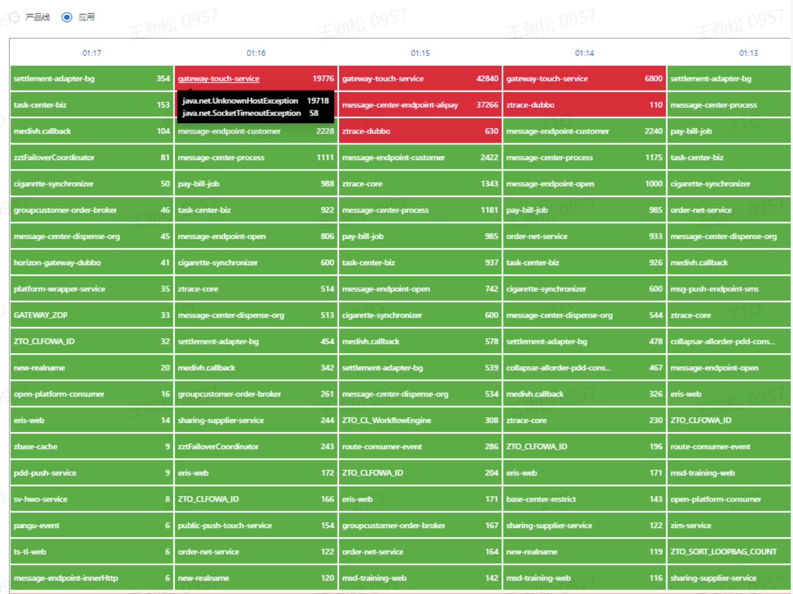
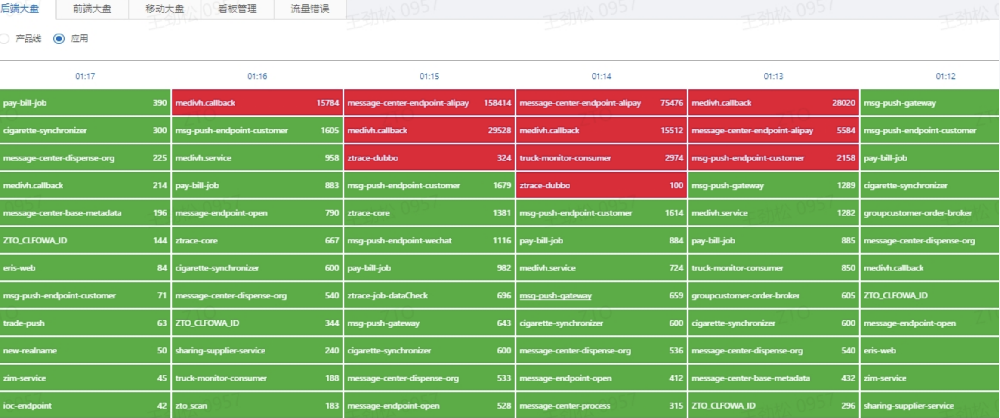
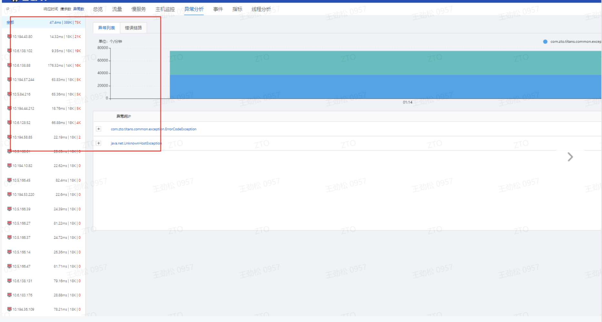

# 问题描述

接连2天cat大盘凌晨dns解析异常：java.net.UnknownHostException: XXX域名

异常错误信息：

```
message-center-endpoint-alipay（调用阿里https:///gateway.do报错java.net.UnknownHostException: openapi.alipay.com: Name or service not known）
gateway-touch-service （调用淘宝http://pac.partner.taobao.com/gateway/express_message_receiver.do报错java.net.UnknownHostException: pac.partner.taobao.com）
message-endpoint-customer（调用京东 https://route-ql.jd.com/trace/push报错java.net.UnknownHostException: route-ql.jd.com）
message-center-endpoint-huawei（调用华为https://hag.cloud.huawei.com/logistics-callback/v1/express-events/notify报错java.net.UnknownHostException: hag.cloud.huawei.com: Name or service not known）
```

2023.5.23



2023.5.25



错误集中在某个数据中心区域



# 根因分析

## 抓包分析

尝试抓包看下主机上的dns解析情况

```
00 1 * * * root mkdir -p /tmp/10-4-91-52/ ; /usr/bin/timeout 3600 /usr/sbin/tcpdump -i any port 53 -C 20 -W 5000 -w /tmp/10-4-91-52/dns.pcap
```

尝试在经常异常pod抓dns解析情况

```

00 1 * * * root mkdir -p /tmp/message-center-endpoint-alipay-k8s-689b55f8f5-qwttx; /usr/bin/timeout 3600 /usr/bin/nsenter --net=/proc/677896/ns/net /usr/sbin/tcpdump -i eth0  port 53 -C 20 -W 500 -w /tmp/message-center-endpoint-alipay-k8s-689b55f8f5-qwttx/dns.pcap
```

尝试在coredns抓解析

```
00 1 * * * root mkdir -p /tmp/coredns-7c99ddd47b-s62g; /usr/bin/timeout 3600 /usr/bin/nsenter --net=/proc/125240/ns/net /usr/sbin/tcpdump -i eth0   port 53 -C 20 -W 500 -w /tmp/coredns-7c99ddd47b-s62g/dns.pcap
```

尝试在主机上的nodelocaldns抓解析

```

00 1 * * * root mkdir -p /tmp/node-local-dns-tjxm2; /usr/bin/timeout 3600 /usr/bin/nsenter --net=/proc/12429/ns/net /usr/sbin/tcpdump -i any   port 53 -C 20 -W 500 -w /tmp/node-local-dns-tjxm2/dns.pcap
```

尝试dig域名

尝试虚拟主机：10.5.10.98

容器主机：10.4.91.52

```
# dig 域名查看耗时，还有域名解析的信息
00 01 * * * root timeout 3600s bash -c 'while :; do time dig route-ql.jd.com; sleep 1; done &> /tmp/dig-route-ql.jd.com.log
00 01 * * * root timeout 3600s bash -c 'while :; do time dig pac.partner.taobao.com; sleep 1; done &> /tmp/dig-pac.partner.taobao.com.log'
00 01 * * * root timeout 3600s bash -c 'while :; do time dig hag.cloud.huawei.com; sleep 1; done &> /tmp/dig-hag.cloud.huawei.com.log'
00 01 * * * root timeout 3600s bash -c 'while :; do time dig api.map.baidu.com; sleep 1; done &> /tmp/dig-api.map.baidu.com.log'
```

## DNS配置分析

DNSserver配置

```
cat  /etc/named.conf  | grep -v '^#\|^$' | grep -v '^//\|^$'
options {
        listen-on port 53 { any; };
        directory       "/var/named";
        dump-file       "/var/named/data/cache_dump.db";
        statistics-file "/var/named/data/named_stats.txt";
        memstatistics-file "/var/named/data/named_mem_stats.txt";
        allow-query     { any; };
        dnssec-enable no;
        dnssec-lookaside no;
        dnssec-validation no;
        recursion yes;
        forward only;
        forwarders {
        //114.114.114.114;
        223.5.5.5;
        223.6.6.6;
        8.8.8.8;
        8.8.4.4;
        202.106.0.20;
        };
};
logging {
        channel query_log {
                file "query.log"  versions 24 size 500m;
                severity debug 3;
                print-time   yes;
                print-category  yes;
         };
         category queries {
                 query_log;
        };
};
statistics-channels {
  inet 0.0.0.0 port 8053 allow { any; };
};
zone "." IN {
        type hint;
        file "named.ca";
};
include "/etc/named.rfc1912.zones";
include "/etc/named.root.key";
```

> 发现配置中，forward only;
> forwarders {
> //114.114.114.114;
> 223.5.5.5;
> 223.6.6.6;
> 8.8.8.8;
> 8.8.4.4;
> 202.106.0.20;
> };
>
> 如果要禁止BIND在无法联系到转发器时不做任何操作，那么你还可以使用 forward only 命令，这样BIND只能使用区的权威数据和缓存来响应查询了（ 在连接不到转发器的情况下 ）

参考

https://docstore.mik.ua/orelly/networking_2ndEd/dns/ch10_05.htm

https://bind9.readthedocs.io/en/v9.18.13/chapter3.html#forwarding-resolver-configuration
