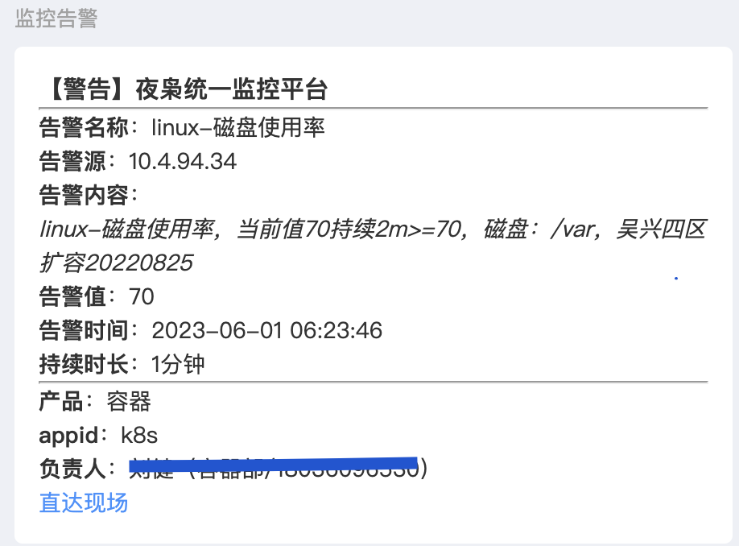
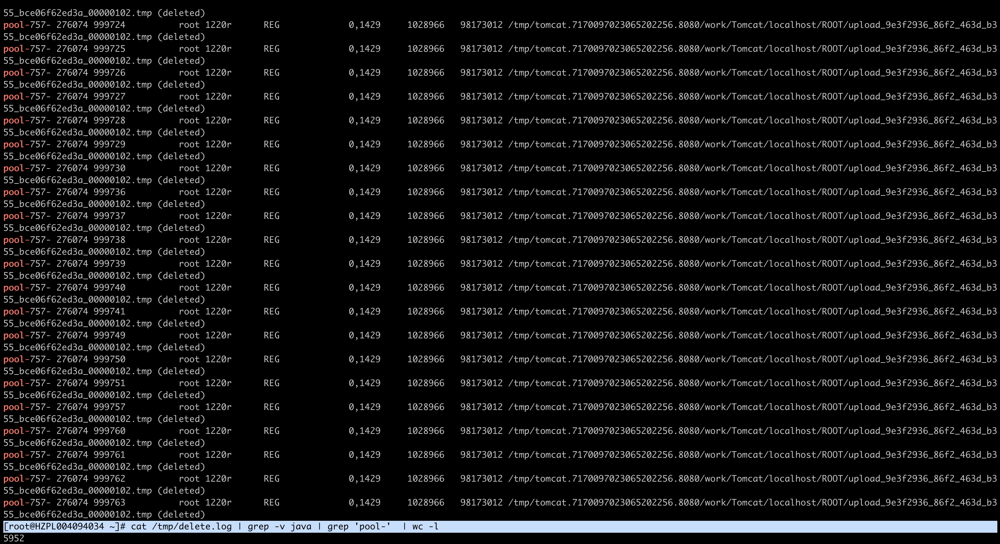
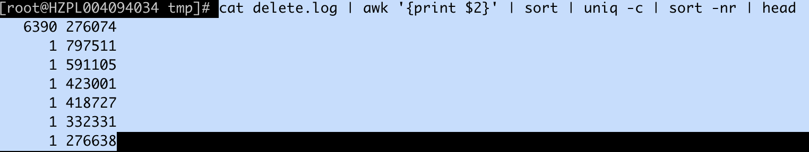
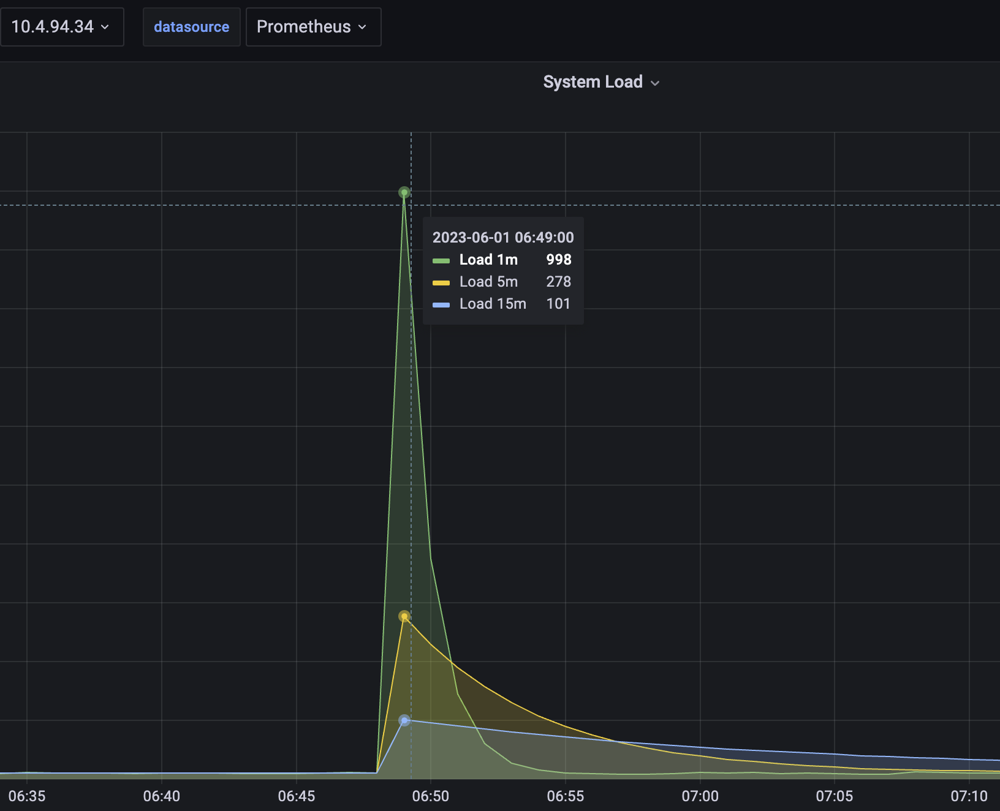
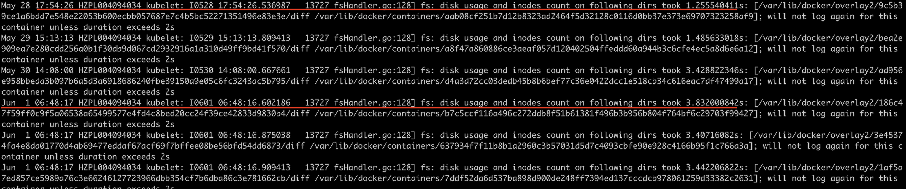

# 问题描述

1、磁盘容量告警

2、对主机进行磁盘检查并尝试清理磁盘占用较高的pod，有5900多个文件描述符被打开没有关闭。

通过平台删除该pod: product-center-query-pro-remain-5bfb5f4c98-m2l55

3、主机负载冲高，触发告警

# 根因排查

1、根据系统日志发现磁盘最早在5月28日就出现了磁盘inode统计超时情况。

# 解决方案

* 立即对主机进行疏散，避免再次出现异常，导致主机负载升高，影响业务pod。
* 增加该kubelet日志告警（fs: disk usage and inodes count on following dirs took 1），提前发现及时人工介入进行处理。
