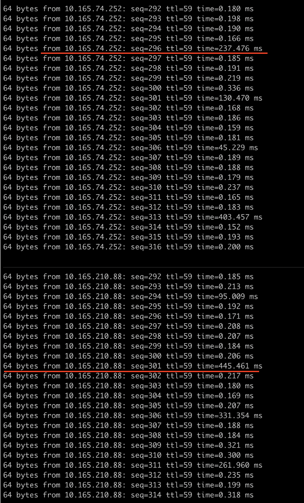
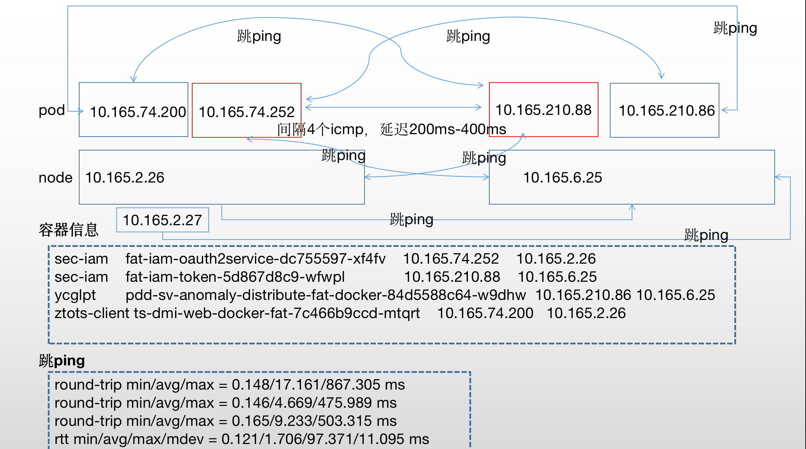

# 问题描述

1、根据业务方的反馈，有2个容器之前存在网络延迟，但同一集群并未有其他人反馈异常

pod1（10.165.74.252） ---> pod2（10.165.210.88） ping延迟稳定4个包出现一个包延迟200-400ms



# 根因分析

1、检查物理机管理控制台日志，排查是否存在异常日志，登录带外检查并未发现异常。

2、检查了容器网络，我们集群CNI用的是calico，检查主机上calico-node状态正常，并且日志并未发现异常。

```
# 2个容器所在节点上calico-node状态正常，日志并未发现异常日志。
calico-node-7np2p                             1/1     Running   0          322d    10.165.6.25      10.165.6.25   <none>           <none>
calico-node-gcn4c                             1/1     Running   0          11d     10.165.2.26      10.165.2.26   <none>           <none>
```

3、其他容器及该集群网络ping延迟测试，从下午可以看出，主机与主机、pod与pod之间都存在跳ping，问题依旧无法定位。



4、尝试对10.165.2.26主机进行网卡上联接口切换测试并验证pod1和pod2之间是否存在持续的4个包之后高延迟一次。

这里down 一个口之后，物理机网卡出现了主从切换，网络的延迟突然出现改善，从这里判断网卡的p1p1接口可能存在问题。

```
# p1p1上联接口down后如下
ip a | grep bond0
6: p1p1: <NO-CARRIER,BROADCAST,MULTICAST,SLAVE,UP> mtu 1500 qdisc mq master bond0 state DOWN group default qlen 1000
7: p1p2: <BROADCAST,MULTICAST,SLAVE,UP,LOWER_UP> mtu 1500 qdisc mq master bond0 state UP group default qlen 1000
10: bond0: <BROADCAST,MULTICAST,MASTER,UP,LOWER_UP> mtu 1500 qdisc noqueue state UP group default qlen 1000
    inet 10.165.2.26/24 brd 10.165.2.255 scope global bond0
# 延迟恢复
64 bytes from 10.165.74.252: seq=1262 ttl=59 time=0.190 ms
64 bytes from 10.165.74.252: seq=1263 ttl=59 time=0.225 ms
64 bytes from 10.165.74.252: seq=1264 ttl=59 time=0.237 ms
64 bytes from 10.165.74.252: seq=1265 ttl=59 time=0.214 ms
...
64 bytes from 10.165.210.88: seq=1707 ttl=59 time=0.180 ms
64 bytes from 10.165.210.88: seq=1708 ttl=59 time=0.194 ms
64 bytes from 10.165.210.88: seq=1709 ttl=59 time=0.207 ms
64 bytes from 10.165.210.88: seq=1710 ttl=59 time=0.220 ms
64 bytes from 10.165.210.88: seq=1711 ttl=59 time=0.208 ms

```

检查网卡光模块是否存在光衰，判断是否存在光模块故障，或者光纤的问题。最终更换了p1p1的光模块和光纤线之后发现光衰均是正常的。

```
[root@SHTL165002026 ~]# ethtool -m p1p2 | grep "Receiver signal" |  head -1 | awk -F '/' '{print $2}'
 -3.08 dBm
[root@SHTL165002026 ~]# ethtool -m p1p1 | grep "Receiver signal" |  head -1 | awk -F '/' '{print $2}'
 -2.59 dBm
[root@SHTL165002026 ~]# ethtool -m p1p1 | grep "Laser output power" |  head -1 | awk -F '/' '{print $2}'
 -2.65 dBm
[root@SHTL165002026 ~]# ethtool -m p1p2 | grep "Laser output power" |  head -1 | awk -F '/' '{print $2}'
 -2.65 dBm
```

# 解决方案

1、首先尝试更换了光模块和光纤但未解决，先停止p1p1口，将主机的网卡

```
# 切换网卡
ifenslave -c bond0 p1p2
# 查看网卡状态
[root@SHTL165002026 ~]# cat /proc/net/bonding/bond0
Ethernet Channel Bonding Driver: v3.7.1 (April 27, 2011)

Bonding Mode: fault-tolerance (active-backup)
Primary Slave: None
Currently Active Slave: p1p2
MII Status: up
MII Polling Interval (ms): 100
Up Delay (ms): 0
Down Delay (ms): 0

Slave Interface: p1p1
MII Status: up
Speed: 10000 Mbps
Duplex: full
Link Failure Count: 2
Permanent HW addr: 34:80:0d:a4:2c:e0
Slave queue ID: 0

Slave Interface: p1p2
MII Status: up
Speed: 10000 Mbps
Duplex: full
Link Failure Count: 1
Permanent HW addr: 34:80:0d:a4:2c:e1
Slave queue ID: 0
```

2、联系硬件厂商保修该主机。

这里怀疑是因为网卡设备问题，
