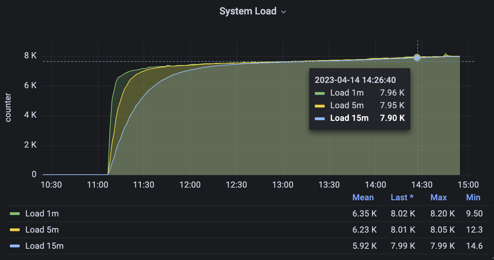
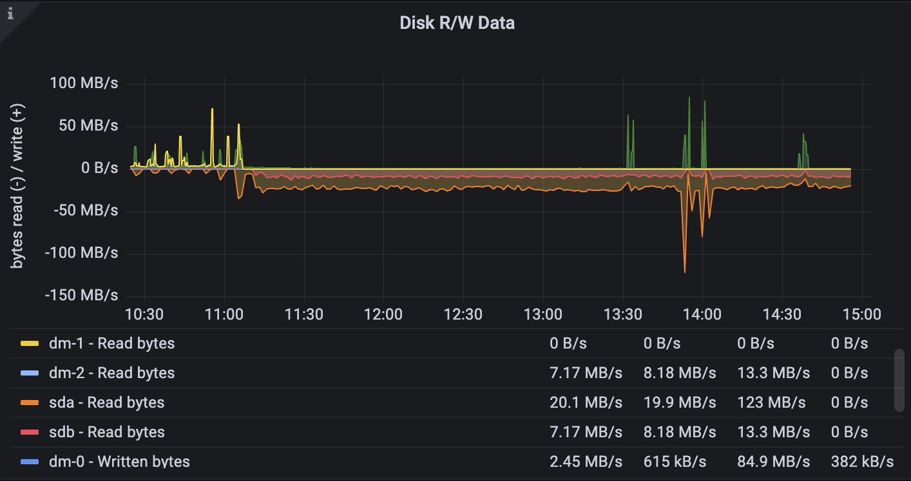
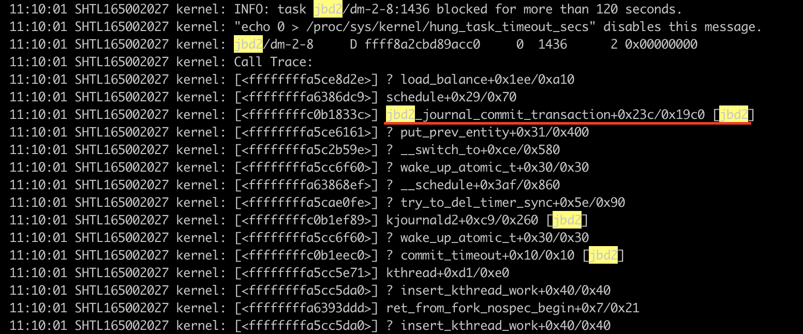
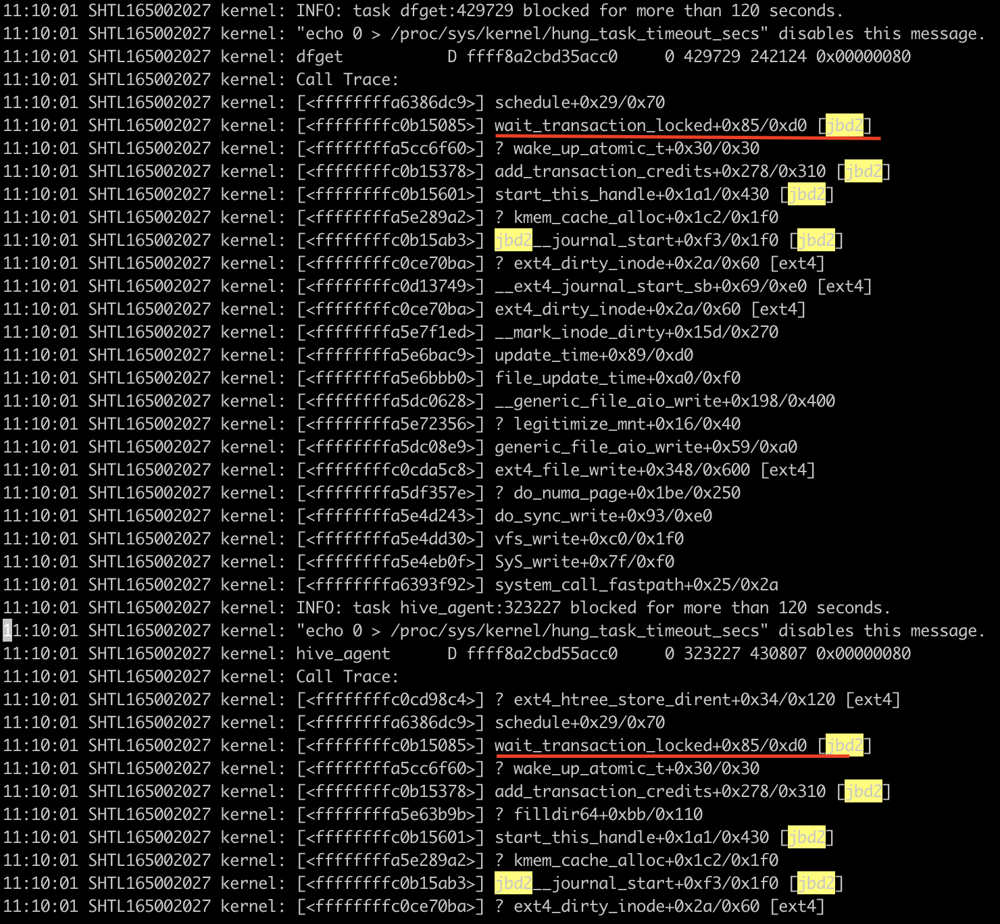
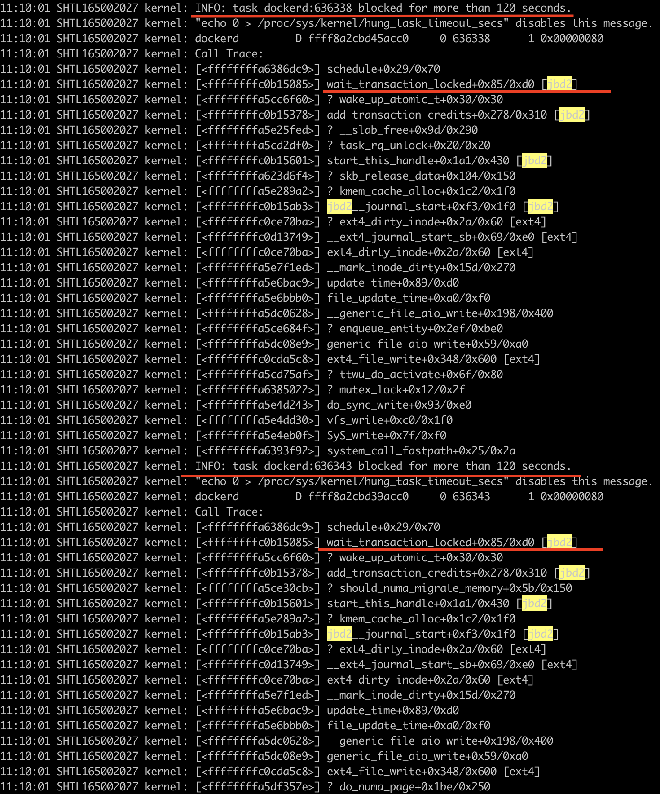

# 背景

容器主机告警平均负载告警超过1w多，导致业务容器出现超时被迫强制驱逐节点。这个问题频繁出现多次，每次现象基本一致，每次都会出现一次OOM，之后就会出现一个内核异常 `kernel: INFO: task jbd2/dm-2-8:1436 blocked for more than 120 seconds.`，之后所有涉及到文件系统读写的程序都会卡在不中断的睡眠状态（D）然后导致平均负载在2分钟左右直线飙升。

* 系统版本：centos7.9
* 内核版本：3.10.0-1160.11.1.el7
* 文件系统：EXT4

平均负载



读IOPS明显升高


IO读明显增多，正常情况是写多读少（容器写日志）



系统日志

```
 11:10:01 SHTL165002027 kernel: INFO: task jbd2/dm-2-8:1436 blocked for more than 120 seconds.
 11:10:01 SHTL165002027 kernel: "echo 0 > /proc/sys/kernel/hung_task_timeout_secs" disables this message.
 11:10:01 SHTL165002027 kernel: jbd2/dm-2-8     D ffff8a2cbd89acc0     0  1436      2 0x00000000
 11:10:01 SHTL165002027 kernel: Call Trace:
 11:10:01 SHTL165002027 kernel: [<ffffffffa5ce8d2e>] ? load_balance+0x1ee/0xa10
 11:10:01 SHTL165002027 kernel: [<ffffffffa6386dc9>] schedule+0x29/0x70
 11:10:01 SHTL165002027 kernel: [<ffffffffc0b1833c>] jbd2_journal_commit_transaction+0x23c/0x19c0 [jbd2]
 11:10:01 SHTL165002027 kernel: [<ffffffffa5ce6161>] ? put_prev_entity+0x31/0x400
 11:10:01 SHTL165002027 kernel: [<ffffffffa5c2b59e>] ? __switch_to+0xce/0x580
 11:10:01 SHTL165002027 kernel: [<ffffffffa5cc6f60>] ? wake_up_atomic_t+0x30/0x30
 11:10:01 SHTL165002027 kernel: [<ffffffffa63868ef>] ? __schedule+0x3af/0x860
 11:10:01 SHTL165002027 kernel: [<ffffffffa5cae0fe>] ? try_to_del_timer_sync+0x5e/0x90
 11:10:01 SHTL165002027 kernel: [<ffffffffc0b1ef89>] kjournald2+0xc9/0x260 [jbd2]
 11:10:01 SHTL165002027 kernel: [<ffffffffa5cc6f60>] ? wake_up_atomic_t+0x30/0x30
 11:10:01 SHTL165002027 kernel: [<ffffffffc0b1eec0>] ? commit_timeout+0x10/0x10 [jbd2]
 11:10:01 SHTL165002027 kernel: [<ffffffffa5cc5e71>] kthread+0xd1/0xe0
 11:10:01 SHTL165002027 kernel: [<ffffffffa5cc5da0>] ? insert_kthread_work+0x40/0x40
 11:10:01 SHTL165002027 kernel: [<ffffffffa6393ddd>] ret_from_fork_nospec_begin+0x7/0x21
 11:10:01 SHTL165002027 kernel: [<ffffffffa5cc5da0>] ? insert_kthread_work+0x40/0x40
```

# 初步分析

该问题出现了半年之久，亟需处理否则严重影响用户上容器的信心。每次出现几乎没有什么征兆，几分钟内load average负载飙升至极高数值整个系统夯死，在仔细分析当时的系统日志后发现，首次OOM后都会出现 `jbd2/dm-xxxx blocked for more than 120 seconds`的信息，在jbd2日志之后就会出现很多应用在等jbd2释放锁 `kernel:xxxxxx wait_transaction_locked+0x85/0xd0 [jbd2] `

jbd2提交事务导致文件系统死锁



其他程序等待jbd2程序释放锁



dockerd 进程也在等待该锁释放（这里就能解释为什么容器会出现异常）



到这里，我们基本上可以断定异常是由于jbd2异常产生的锁导致的，那什么是jbd2呢？为什么jbd2会产生锁呢？

> 什么是ext4/jbd2 ,参考 Linux: The Journaling Block Device（[https://web.archive.org/web/20070926223043/http://kerneltrap.org/node/6741](https://web.archive.org/web/20070926223043/http://kerneltrap.org/node/6741)），ext4 文件系统基于 jbd2 以 WAL（write-ahead logging）形式更新元数据，防止系统 crash 时发生元数据损坏。每一个 ext4 文件系统实例对应一个 jbd2 Journal 实例。每个用户线程的一次数据更新称为一个 Handle，在时间上连续的多个 Handle（可能来自不同线程）组成一个 Transaction，以便实现批量提交。Transaction 提交满足原子性。

# 现场勘查

这次我驱逐节点后，通过SysRq手动触发生成vmcore文件，使用crash和kernel-debuginfo工具包打开vmcore文件进行现场勘查。先看下D进程的情况，可以看到有7w个进程，其中有2081个进程处于僵死状态，大部分是Java进程。

生成vmcore包和配置使用crash请参考我的另一篇博文 ：[Linux使用crash分析vmcore dump文件](https://www.ljohn.cn/2023/02/28/linux-shi-yong-crash-fen-xi-vmcore-dump-wen-jian/)

```bash

# 通过SysRq手动触发生成crash，执行命令会导致crash重启，请确保主机已经驱逐完成再执行如下命令
echo 1 > /proc/sys/kernel/sysrq; echo c > /proc/sysrq-trigger
# 执行crash打开vmcore文件
crash /var/crash/127.0.0.1-2023-04-14-14\:41\:25/vmcore /usr/lib/debug/lib/modules/$(uname -r)/vmlinux
crash> sys
      KERNEL: /usr/lib/debug/lib/modules/3.10.0-1160.11.1.el7.x86_64/vmlinux
    DUMPFILE: /var/crash/127.0.0.1-2023-04-14-14:41:25/vmcore  [PARTIAL DUMP]
        CPUS: 64
        DATE: Fri Apr 14 14:54:59 2023
      UPTIME: 265 days, 18:15:40
LOAD AVERAGE: 8014.48, 8010.96, 7991.18
       TASKS: 71817
    NODENAME: SHTL165002027
     RELEASE: 3.10.0-1160.11.1.el7.x86_64
     VERSION: #1 SMP Fri Dec 18 16:34:56 UTC 2020
     MACHINE: x86_64  (2300 Mhz)
      MEMORY: 511.6 GB
       PANIC: "SysRq : Trigger a crash"
crash> ps | wc -l  // 查看有7w多个进程
71818
crash> ps | grep UN | wc -l //其中798个进程处于僵死状态
7986  
crash> ps | grep UN | head -n 100 //可以看到处于僵死状态大部分是 java应用,dockerd,还有我们排查问题执行top命令。
   1436      2  53  ffff89ee1e34b180  UN   0.0       0      0  [jbd2/dm-2-8]
   1491      1   0  ffff89f3615b4200  UN   9.0 66592600 48622076  dockerd
   2047   1597   5  ffff89f0534c5280  UN   0.0  162396   2096  top
   2779  949049  58  ffff89f11a2e2100  UN   0.2 9869832 1204676  java
   2810  949049  24  ffff89e718692100  UN   0.2 9869832 1204676  java
   4270   3718  36  ffff89f1194d3180  UN   0.0  162396   2104  top
   6059      1   1  ffff8a07cba1b180  UN   9.0 66592600 48622076  dockerd
   6476   5991   8  ffff89f080894200  UN   0.0  162396   2108  top
   7693  949049  30  ffff89f092ae9080  UN   0.2 9869832 1204676  java
   8380  949049  22  ffff89b079759080  UN   0.2 9869832 1204676  java
   8486   7982  36  ffff89f02ac19080  UN   0.0  162396   2120  top
   8588  949049  50  ffff89e24c028000  UN   0.2 9869832 1204676  java
   9668      1   7  ffff89ec0b8b1080  UN   9.0 66592600 48622076  dockerd
   9669      1  15  ffff89cb80f4a100  UN   9.0 66592600 48622076  dockerd
   9731      1  30  ffff89ef0e78b180  UN   9.0 66592600 48622076  dockerd
  10141  949049  19  ffff89ca209c2100  UN   0.2 9869832 1204676  java
  10152  949049  52  ffff89f0e6983180  UN   0.2 9869832 1204676  java
  10333  949049  38  ffff8a160e7ae300  UN   0.2 9869832 1204676  java
  10479   9964  37  ffff89b09304d280  UN   0.0  162396   2128  top
  10967  949049  22  ffff89c2315bd280  UN   0.2 9869832 1204676  java
  10968  949049  18  ffff89b6cea34200  UN   0.2 9869832 1204676  java
  11015  949049  10  ffff89b088dc1080  UN   0.2 9869832 1204676  java
  11860  949049   8  ffff89b17d636300  UN   0.2 9869832 1204676  java
  11907  11842  12  ffff89b06a81d280  UN   0.4 25038368 1934220  java
  11913  11842   2  ffff89bd016c3180  UN   0.4 25038368 1934220  java
  11914  11842  46  ffff89bd016c0000  UN   0.4 25038368 1934220  java
  11916  11842  31  ffff89b10f9e2100  UN   0.4 25038368 1934220  java
```

有这么多进程处于僵死状态，先统计下所有hung住的进程都hung在哪里

```
crash> foreach UN bt | awk '/#2/ {print $3,$5}' |sort|uniq -c|sort -rn
   5808 rwsem_down_read_failed ffffffffa63887b5
   1944 wait_transaction_locked ffffffffc0b15085
    121 rwsem_down_write_failed ffffffffa6388505
     98 __mutex_lock_slowpath ffffffffa6385c57
     45 system_call_fastpath ffffffffa6393f92
     17 TASK: CPU:
     11 __mutex_lock_killable_slowpath ffffffffa638550c
      2 sys_fchmod ffffffffa5e4c56f
      2 schedule_timeout ffffffffa63848b1
      1 jbd2_log_wait_commit ffffffffc0b1e8c5
      1 jbd2_journal_commit_transaction ffffffffc0b1833
```

可以看到有5808个进程在等待rwsem，推测进程卡住是因为程序在尝试获取读锁失败了，导致大量进程进入不可中断的睡眠状态，等待其他进程释放读锁，查看最早卡死的进程，可以看到有jbd2/dm-xxx进程出现了僵死，查看log日志可以看到磁盘出现了 `jbd2/dm-xxxx blocked for more than 120 seconds`

> `rwsem_down_read_failed` 是Linux内核中的一个函数，作用是尝试获取读锁，如果获取失败，会让当前进程进入睡眠状态，等待其他进程释放读锁，然后再尝试获取读锁。rwsem_down_read_failed 是Linux内核中的一个函数，它用于尝试获取一个读写信号量（读写锁），如果获取失败，会导致当前进程进入睡眠状
>
> `wait_transaction_locked` 是Linux内核中的一个函数，作用是等待一个事务锁被释放。当一个进程需要访问一个由事务锁保护的数据结构时，它必须先获得该锁。如果锁已被其他进程占用，当前进程将被阻塞，并调用 `wait_transaction_locked` 函数等待锁被释放。

# 问题复现

```

crash> bt 6476
PID: 6476   TASK: ffff89f080894200  CPU: 8   COMMAND: "top"
 #0 [ffff89fb53773cb8] __schedule at ffffffffa63868a7
 #1 [ffff89fb53773d40] schedule at ffffffffa6386dc9
 #2 [ffff89fb53773d50] rwsem_down_read_failed at ffffffffa63887b5
 #3 [ffff89fb53773dd8] call_rwsem_down_read_failed at ffffffffa5f97728
 #4 [ffff89fb53773e28] down_read at ffffffffa63860b0
 #5 [ffff89fb53773e40] proc_pid_cmdline_read at ffffffffa5eca7a2
 #6 [ffff89fb53773ed8] vfs_read at ffffffffa5e4db9f
 #7 [ffff89fb53773f08] sys_read at ffffffffa5e4ea1f
 #8 [ffff89fb53773f50] system_call_fastpath at ffffffffa6393f92
    RIP: 00007fdb285fd9a0  RSP: 00007ffc44153ee8  RFLAGS: 00000246
    RAX: 0000000000000000  RBX: 00007fdb29575010  RCX: ffffffffffffffff
    RDX: 0000000000020000  RSI: 00007fdb29575010  RDI: 0000000000000007
    RBP: 0000000000020000   R8: 0000000000000000   R9: 00007fdb2855b2cd
    R10: 0000000000000000  R11: 0000000000000246  R12: 0000000000000000
    R13: 00007fdb29575010  R14: 0000000000000000  R15: 0000000000000007
    ORIG_RAX: 0000000000000000  CS: 0033  SS: 002b
crash> whatis down_read
void down_read(struct rw_semaphore *)
crash> rd ffff89fb53773dd8 -e ffff89fb53773e28
ffff89fb53773dd8:  ffffffffa5f97728 0000000000000000   (w..............
ffff89fb53773de8:  0000000000000246 0000000000013dd6   F........=......
ffff89fb53773df8:  ffffdf165195d040 ffffffffa668e577   @..Q....w.h.....
ffff89fb53773e08:  ffff89fb53773fd8 0000000000000000   .?wS............
ffff89fb53773e18:  ffff8a191c939338 ffff89fb53773e38   8.......8>wS....  //ffff8a191c939338值
crash> struct rw_semaphore ffff8a191c939338
struct rw_semaphore {
  {
    count = {
      counter = -4294967293
    },
    __UNIQUE_ID_rh_kabi_hide1 = {
      count = -4294967293
    },
    {<No data fields>}
  },
  wait_lock = {
    raw_lock = {
      val = {
        counter = 0
      }
    }
  },
  osq = {
    tail = {
      counter = 0
    }
  },
  wait_list = {
    next = 0xffff89eb2c143e20
  },
  owner = 0xffff89ea04f2a103 //owner所属值
}

```

得到该值后,该owner所属的进程是一个PID为1387203的Java进程，该进程可以看到是jbd2处理transaction的过程中出现了异常：进程在等待Journal Transaction  Commit

# 参考

[容器因内存频繁OOM而引发的内核“血案”](https://cloud.tencent.com/developer/article/1880507)

[centos7 cgroup oom触发ext4文件系统bug](https://cloud.tencent.com/developer/article/1982759)

[由 OOM 引发的 ext4 文件系统卡死](https://cloud.tencent.com/developer/article/1782057)

[Kernel源码查询](https://elixir.bootlin.com/linux/v3.10/source/arch/x86)
