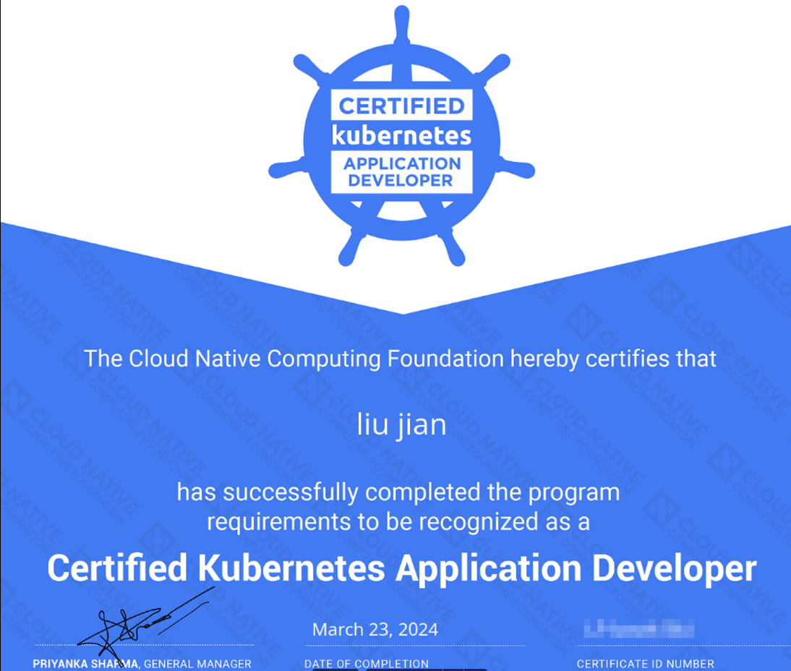
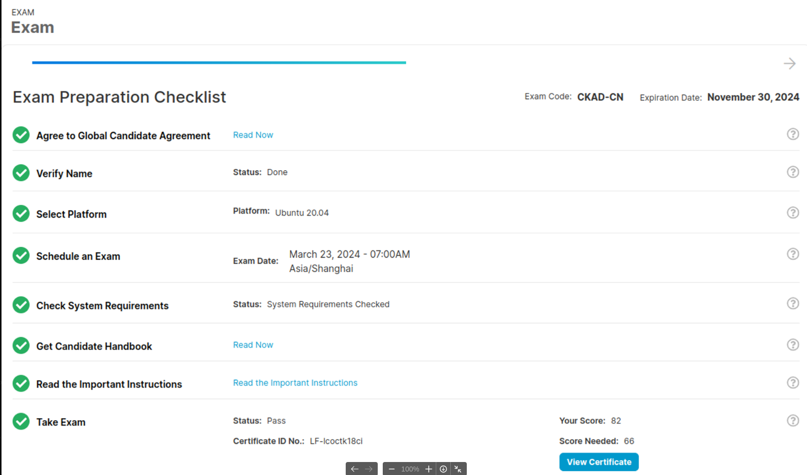

# 简述

* 这个认证相比较CKA，难度一般，内容在k8s应用上会更丰富一些，但也都比较基础，运维/开发同学报考1-2周考下来，毫无压力。
* 惟手熟尔，考试时间很充裕，但前提是要有一定Linux命令基础，考试课程提供了1套练习题，可以练习2次，尽可能2小时内完成所有题目，个人考试80分钟就完成了，20分钟所有题目都检查一遍，另外，不会做的要跳过，切勿因小失大。
* 考试期间是可以翻看官方文档的，一定是根据关键字搜索使用的。另外kubectl 命令行帮助文档很有用，大部分题目是不需要翻官方文档的，通过命令行就可以创建大部分资源。如果每道题都翻看文档，时间就可能不会特别充裕。

# 考试结果

# 考试大纲

参考：[https://training.linuxfoundation.cn/certificates/4](https://training.linuxfoundation.cn/certificates/4)

考试课程包括这些一般领域及其在考试中的权重：

* 应用程序设计和构建–20%
* 应用部署 - 20％
* 应用观察和维护 - 15％
* 应用环境、配置与安全 - 25％
* 服务与网络 - 20％

**详细内容**

应用程序设计和构建–20%

* 定义、构建和修改容器鏡像
* 了解Jobs 和 CronJobs
* 了解多容器Pod设计模式(例如sidecar, init等)
* 使用持久卷和临时卷

应用部署 - 20％

* 使用Kubernetes原语来实现通用的部署策略(例如，蓝绿部署或金丝雀部署)
* 理解部署和如何执行滚动更新
* 使用Helm包管理器部署现有的包

应用观察和维护 - 15％

* 理解API的用法
* 实现探测和运行状况检查
* 使用提供的工具来监视Kubernetes应用程序
* 利用容器日志
* 在Kubernetes中调试

应用环境、配置与安全 - 25％

* 发现并使用扩展Kubernetes (CRD)的资源
* 了解身份验证、授权和准入控制
* 了解和定义资源需求、限制和配额
* 了解ConfigMaps
* 创造并使用Secrets
* 了解ServiceAccounts
* 了解SecurityContexts

服务与网络 - 20％

* 对网络策略有基本的了解
* 通过服务提供对应用程序的访问并排除故障
* 使用Ingress规则公开应用程序

# 学习资料

1、模拟题笔记：

[https://www.ljohn.cn/categories/ckad/](https://www.ljohn.cn/categories/ckad/)

2、备考指南：[https://mainframe2cloud.com/如何备考CKAD认证/](https://mainframe2cloud.com/%E5%A6%82%E4%BD%95%E5%A4%87%E8%80%83CKAD%E8%AE%A4%E8%AF%81/)

3、练习题笔记：[https://github.com/dgkanatsios/CKAD-exercises/tree/main](https://github.com/dgkanatsios/CKAD-exercises/tree/main)

4、**Udemy CKAD**视频：[https://www.bilibili.com/video/BV14S4y1c7Sh/?p=5&amp;spm_id_from=pageDriver&amp;vd_source=ae33dc49f3801f36e832f78caf92929e](https://www.bilibili.com/video/BV14S4y1c7Sh/?p=5&spm_id_from=pageDriver&vd_source=ae33dc49f3801f36e832f78caf92929e)
