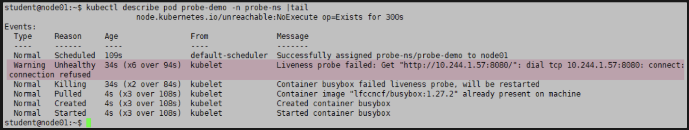

## 题目要求

由于Liveness Probe 发生了问题 您无法访问一个应用程序。该应用程序可能在任何 namespace 中运行

1. 找出对应的 Pod 并将其名称和 namespace 写入文件 **/ckad/CKAD00011/broken.txt** 使用以下格式 `<namespaceName>/<podName>`文件 **/ckad/CKAD00011/broken.txt** 已存在
2. 用 **kubectl get events** 来获取相关错误事件井将其写入文件 **/ckad/CKAD00011/error.txt** 请使 @用输出格式 **wide**文件 **/ckad/CKAD00011/error.txt** 已存在 。
3. 修复故障的 Pod 的 Liveness Probe 问题。

## 参考

[https://kubernetes.io/zh-cn/docs/tasks/configure-pod-container/configure-liveness-readiness-startup-probes/](https://kubernetes.io/zh-cn/docs/tasks/configure-pod-container/configure-liveness-readiness-startup-probes/)

## 解答

```bash
# 首先获取所有pod,并查找不正常的pod, describe pod 查看事件信息
kubectl get pod -A 
kubectl describe pod probe-demo -n probe-ns | tail
# 如下图
# 1.写入文件 **/ckad/CKAD00011/broken.txt**
echo probe-ns/probe-demo > /ckad/CKAD00011/broken.txt
# 2.写入文件 /ckad/CKAD00011/error.txt 
kubectl -n probe-ns get events -o wide | grep probe-demo > **/ckad/CKAD00011/error.txt** 
# 3.查看下图，可以看到存活探针，无法探测通，查看服务中暴露的端口 8443，所以修改liveNess配置
kubectl -n probe-ns edit probe-demo 
...
httpGet:
  path:
  port: 8443
...

# 测试验证
kubectl -n probe-ns get probe-demo
kubectl -n probe-ns describe pod probe-demo
```


