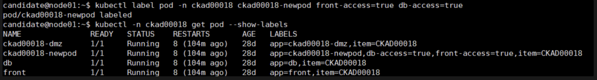

## 题目要求

更新在namespace **ckad00018** 中的 Pod **ckad00018-newpod**

使其使用一个只允许此 Pod 与 Pod **front** 和 **db** 之间收发流量的 Networkpolicy 。

## 参考

[https://kubernetes.io/zh-cn/docs/concepts/services-networking/network-policies/](https://kubernetes.io/zh-cn/docs/concepts/services-networking/network-policies/)

## 解答

```bash
# 查看pod 和networkpolicy
kubectl -n ckad00018 get pod --show-labels
kubectl -n ckad00018 get networkpolicies --show-labels
# 查看networkpolicy 的 podselector
kubectl -n ckad00018 get networkpolicies access-db -oyaml | grep -i -A3 podselector
kubectl -n ckad00018 get networkpolicies access-front -oyaml | grep -i -A3 podselector
# 通过查看所有networkpolicy 得知，
# front和 db 各有一个 networkpolicy ckad00018-newpod 没networkpolicy
# 所以查看front 和 db 的 networkpolicy 标签 把可以跟他们互通的标签 ，设置 给 ckad00018-newpod
kubectl -n ckad00018 label pod  ckad00018-newpod front-access=true db-access=true
kubectl -n ckad00018 get pod --show-labels  # 如下图
```


