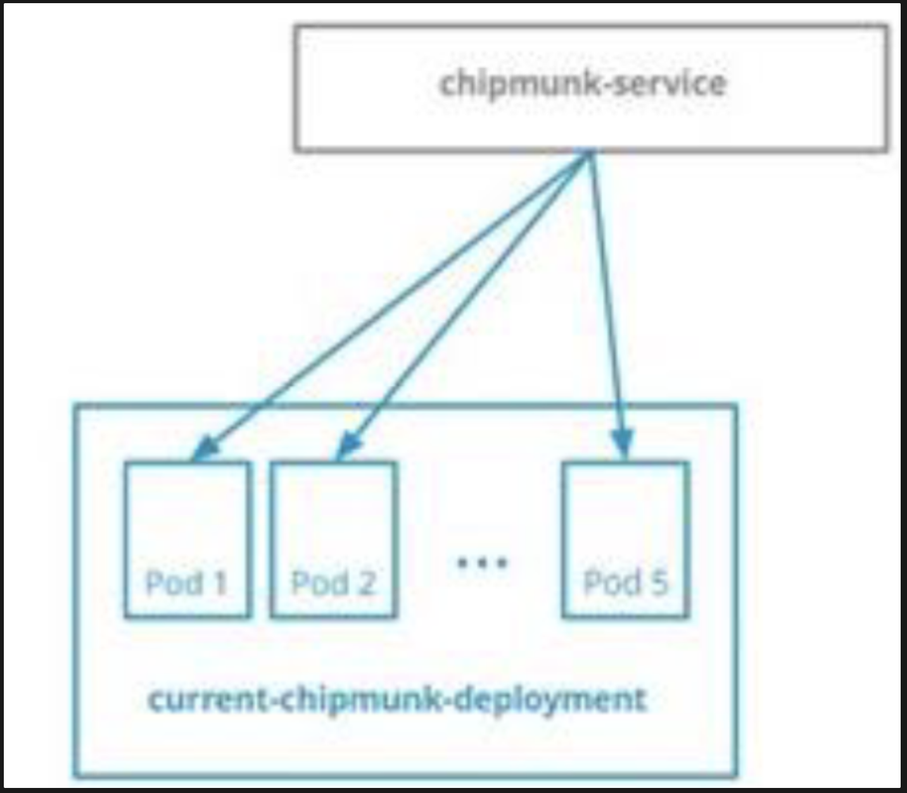
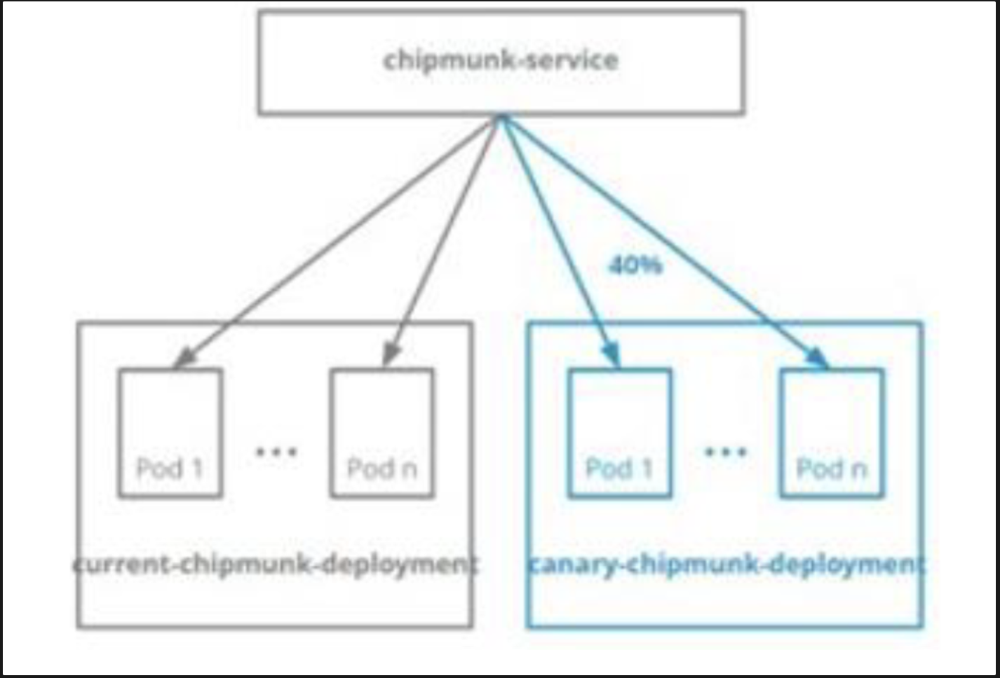

## 题目要求

namespace **goshawk** 中名为 **chipmunk-service** 的 Service 指向名为 **current-chipmunk-deployment** 的 Deployment 创建的 5 个 Pod



你可以在 **/ckad/goshawk** 中找到 **current-chipmunk-deployment** 的清单文件。

1. 在同一 namespace 中创建一个 相同的 Deployment 名为 **canary-chipmunk-deployment**
2. 修改 Deployment 以便
   - 在 namespace **goshawk** 中运行的 Pod 的最大数量为 **10** 个
   - **chipmunk.servic**e 流量的 **40%** 流向 Pod **canary-chipmunk-deployment**



## 参考

https://kubernetes.io/zh-cn/docs/concepts/cluster-administration/manage-deployment/#canary-deployments

## 解答

```bash
# 1.复制一份yaml文件,并进行编辑, 修改为canary-chipmunk-deployment部署的yaml
cd /ckad/goshawk/
cp current-chipmunk-deployment.yaml canary-chipmunk-deployment.yaml
vim canary-chipmunk-deployment.yaml

apiVersion: apps/v1
kind: Deployment
metadata:
  name: canary-chipmunk-deployment #修改为题目要求
  namespace: goshawk #修改为题目要求
spec:
  replicas: 1
  selector:
    matchLabels:
      app: canary-chipmunk-deployment #修改为题目要求
      run: dep-svc #确保和current-chipmunk-deployment都有此标签
  template:
    metadata:
      labels:
        app: canary-chipmunk-deployment #修改为题目要求
        run: dep-svc #确保和current-chipmunk-deployment都有此标签
    spec:
      containers:
      - image: vicuu/nginx:hi
        name: nginx

# 创建资源
kubectl apply -f canary-chipmunk-deployment.yaml

# 修改pod数量，要求总计10个pod，**chipmunk.servic**e 流量的 **40%** 流向 Pod **canary-chipmunk-deployment
kubectl -n goshawk scale deployment current-chipmunk-deployment --replicas 6
kubectl -n goshawk scale deployment canary-chipmunk-deployment --replicas 4

# 测试验证
kubectl -n goshawk get svc -owide
for i in {1..1000} ; do  curl -qs 10.109.141.220;done | sort |uniq -c
```
