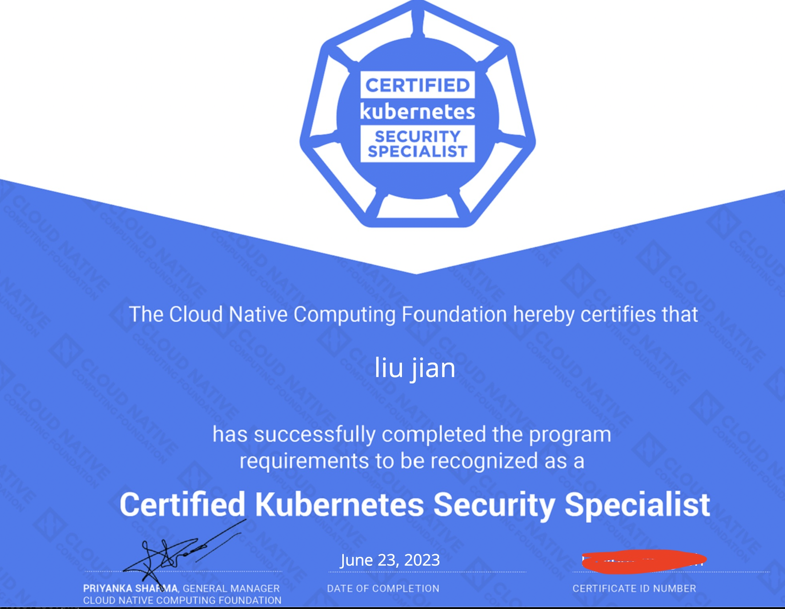

## 考试心得

我是去年3月份考的CKA，5月份考了2次都没有过CKS，主要还是因为个人没有复习好，刷题太少，2次考试都没有过。后来又重新找了几篇2023年最新的真题，针对的进行练习。我几次考CKS经验来看，如果考试题目不熟练的话，时间大概率不够的。由于2022年7月份之后考试PSI系统进行了升级，所有操作都要在ubuntu20.04主机上进行，包括浏览器。



## 第一题 kube-bench 修复不安全项

```bash
Context
针对kubeadm创建的cluster运行CIS基准测试工具时，发现了多个必须立即解决的问题。
Task
通过配置修复所有问题并重新启动受影响的组件以确保新的设置生效。
修复针对API服务器发现的所有以下违规行为：
1.2.7 Ensure that the --authorization-mode argument is not set to AlwaysAllow FAIL
1.2.8 Ensure that the --authorization-mode argument includes Node             FAIL
1.2.9 Ensure that the --authorization-mode argument includes RBAC             FAIL
1.2.18 Ensure that the --insecure-bind-address argument is not set            FAIL (1.23中这项题目没给出，但最好也检查一下，模拟环境里需要改)
1.2.19 Ensure that theinsecure-port argument is set te 0                       FAIL(1.23中这项题目没给出，不需要再修改了)
修复针对kubelet发现的所有以下违规行为：
Fix all of the following violations that were found against the kubelet: 
4.2.1 Ensure that the anonymous-auth argument is set to false                 FAIL
4.2.2 Ensure that the --authorization-mode argument is not set to AlwaysAllow FAIL
注意：尽可能使用Webhook身份验证/授权。

修复针对etcd发现的所有以下违规行为：
Fix all of the following violations that were found against etcd: 
2.2 Ensure that the --client-cert-auth argument is set to true                FAIL
```

解答：

```bash
1、先备份kube-apiserver.yaml,etcd.yaml,config.yaml三个文件；
2、修改kube-apiserver.yaml文件，执行vim /etc/kubernetes/manifests/kube-apiserver.yaml
   - --authorization-mode=Node,RBAC   #修改成Node,RBAC
   - --insecure-bind-address=0.0.0.0  #删除这行
3、修改config.yaml文件，执行vim /var/lib/kubelet/config.yaml
   authentication:
      anonymous:
        enabled: false     #true修改成false
   ...
   authorization:
      mode: Webhook        #把AlwaysAllow修改成Webhook
4、修改etcd.yaml文件, vim /etc/kubernetes/manifests/etcd.yaml
   - --client-cert-auth=true   #修改成true
5、重启kubelet服务
[root@k8s-master manifests]# systemctl daemon-reload 
[root@k8s-master manifests]# systemctl restart kubelet
```

## 第二题 Pod 指定 ServiceAccount

```bash
Context
您组织的安全策略包括：
- ServiceAccount不得自动挂载API凭据
- ServiceAccount名称必须以"-sa"结尾

清单文件/cks/sa/pod1.yaml中指定的Pod由于ServiceAccount指定错误而无法调度。
请完成一下项目：

Task
1.在现有namespace ga中创建一个名为backend-sa的新ServiceAccount,
确保此ServiceAccount不自动挂载API凭据。
2.使用/cks/sa/pod1.yaml中的清单文件来创建一个Pod。
3.最后，清理namespace ga中任何未使用的ServiceAccount。
```

解答

```bash
# 参考：<https://kubernetes.io/zh-cn/docs/reference/access-authn-authz/service-accounts-admin/>
1、创建sa
# kubectl create ns qa
# vim sa.yaml 
apiVersion: v1
kind: ServiceAccount
metadata:
  name: backend-sa
  namespace: qa
automountServiceAccountToken: false               #该行是重点，注意事项

2、创建pod
# cat pod1.yaml 
apiVersion: v1
kind: Pod
metadata:
  name: backend
  namespace: qa
spec:
  serviceAccountName: backend-sa                  #给pod配置serviceaccount
  containers:
  - image: nginx:alpine
    imagePullPolicy: IfNotPresent
    name: backend
# kubectl create -f pod1.yaml 

3、删除没有使用的sa
# kubectl -n qa get sa
# kubectl -n qa delete sa test01
```

## 第三题 默认网络策略

```bash
Context
一个默认拒绝(default-deny)的NetworkPolicy可避免在未定义任何其他NetworkPolicy的namespace中意外公开Pod。
Task
为所有类型为Ingress-+Egress的流量在namespace testing中创建一个名为denypolicy的新默认拒绝NetworkPolicy。
此新的NetworkPolicy必须拒绝namespace testing中的所有的Ingress+Egress流量。
将新创建的默认拒绝NetworkPolicy应用与在namespace testing中运行的所有Pod。

你可以在/cks/net/p1,yaml找到一个模板清单文件。
```

解答：[网络策略](https://kubernetes.io/zh-cn/docs/concepts/services-networking/network-policies/)

```bash
1、创建默认网络策略
# kubectl create ns testing
# cat networkpolicy.yaml 
apiVersion: networking.k8s.io/v1
kind: NetworkPolicy
metadata:
  name: denypolicy
  namespace: testing
spec:
  podSelector: {}                        #拒绝所有pod
  policyTypes:
    - Ingress
    - Egress
  
# kubectl apply -f networkpolicy.yaml

2、检查
# kubectl -n testing describe netpol denypolicy 
Name:         denypolicy
Namespace:    testing
Created on:   2022-12-28 15:18:22 +0800 CST
Labels:       <none>
Annotations:  <none>
Spec:
  PodSelector:     <none> (Allowing the specific traffic to all pods in this namespace)
  Allowing ingress traffic:
    <none> (Selected pods are isolated for ingress connectivity)
  Allowing egress traffic:
    <none> (Selected pods are isolated for egress connectivity)
  Policy Types: Ingress, Egress
```

## 第四题 RBAC - RoleBingding

```bash
Context
绑定到Pod的ServiceAccount的Role授予过度宽松的权限。完成以下项目以减少权限集。
Task
一个名为web-pod的现有Pod已在namespace db中运行。
编辑绑定到Pod的ServiceAccount service-account-web的现有Role,仅允许只对services类型的资源执行get操作。
在namespace db中创建一个名为role-2,并仅允许只对namespaces类型的资源执行delete操作的新Role。
创建一个名为role-2-binding的新RoleBinding,将新创建的Role绑定到Pod的ServiceAccount。
注意：请勿删除现有的RoleBinding。
```

解答：

```bash
1、本地测试环境
# kubectl create ns db
# kubectl -n db create sa service-account-web
# kubectl -n db create role role-1
# kubectl -n db create role role-1 --verb=get,list,watch --resource='*'
# kubectl -n db create rolebinding role-1-binding --role='role-1' --serviceaccount='db:service-account-web'
# cat pod1.yaml 
apiVersion: v1
kind: Pod
metadata:
  name: web-pod
  namespace: db
spec:
  serviceAccountName: service-account-web
  containers:
  - image: nginx:alpine
    imagePullPolicy: IfNotPresent
    name: web-pod
2、答题
# kubectl -n db edit role role-1
apiVersion: rbac.authorization.k8s.io/v1
kind: Role
metadata:
  creationTimestamp: "2022-12-28T07:48:59Z"
  name: role-1
  namespace: db
  resourceVersion: "224470"
  uid: 3406bbfb-25aa-4930-ab29-9abad1e1de77
rules:
- apiGroups:
  - ""
  resources:
  - services                        #按题目要求修改此处
  verbs:
  - get                             #按题目要求修改此处

检查
# kubectl -n db describe role role-1
Name:         role-1
Labels:       <none>
Annotations:  <none>
PolicyRule:
  Resources  Non-Resource URLs  Resource Names  Verbs
  ---------  -----------------  --------------  -----
  services   []                 []              [get]

创建role-2
# kubectl -n db create role role-2 --resource='namespace' --verb='delete' 
role.rbac.authorization.k8s.io/role-2 created
# kubectl -n db describe role role-2 
Name:         role-2
Labels:       <none>
Annotations:  <none>
PolicyRule:
  Resources   Non-Resource URLs  Resource Names  Verbs
  ---------   -----------------  --------------  -----
  namespaces  []                 []              [delete]

创建新rolebinding
# kubectl -n db create rolebinding role-2-binding --role='role-2' --serviceaccount='db:service-account-web'
# kubectl -n db describe rolebindings.rbac.authorization.k8s.io role-2-binding 
Name:         role-2-binding
Labels:       <none>
Annotations:  <none>
Role:
  Kind:  Role
  Name:  role-2
Subjects:
  Kind            Name                 Namespace
  ----            ----                 ---------
  ServiceAccount  service-account-web  db
```

## 第五题 日志审计 log audit （建议最后做，比较耗时，易错题）

```bash
在cluster中启用审计日志。为此，请启用日志后端，并确保：
- 日志存储在 /var/log/kubernetes/.audit-logs.txt
- 日志文件能保留10天
- 最多保留2个旧审计日志文件

/etc/kubernetes/logpolicy/sample-policy.yaml提供了基本策略。它仅指定不记录的内容。
注意：基本策略位于cluster的master节点上。

编辑和扩展基本策略以记录：
- RequestResponse 级别的 persistentvolumes更改
- namespace front-apps 中 configmaps 更改的请求体
- Metadata 级别的所有 namespace 中的 ConfigMap 和 Secret 的更改
此外，添加一个全方位的规则以在Metadata级别记录所有其他请求。
注意：不要忘记应用修改后的策略。
```

解答：

```bash
# 准备环境
# kubectl create ns front-apps
#
# 1.官网文档搜索：audit，可以找到对应策略policy文件模板，并根据要求进行修改生产如下配置文件
# cat /etc/kubernetes/logpolicy/sample-policy.yaml 

apiVersion: audit.k8s.io/v1 
kind: Policy
omitStages:
  - "RequestReceived"
rules:
  - level: RequestResponse
    resources:
    - group: ""
      resources: ["persistentvolumes"]

  - level: Request
    resources:
    - group: "" 
      resources: ["configmaps"]
    namespaces: ["front-apps"]

  - level: Metadata
    resources:
    - group: "" 
      resources: ["secrets", "configmaps"]

  - level: Metadata
    omitStages:
      - "RequestReceived"

# 2.备份kube-apiserver.yaml文件，然后修改/etc/kubernetes/manifests/kube-apiserver.yaml，增加如下内容：
    - --audit-log-path=/var/log/kubernetes/audit-log.txt
    - --audit-log-maxage=10
    - --audit-log-maxbackup=2
    - --audit-policy-file=/etc/kube
    ...
    volumeMounts:
      - mountPath: /var/log/kubernetes
        name: audit-log
        readOnly: false
      - mountPath: /etc/kubernetes/logpolicy
        name: audit
        readOnly: true
    volumes:
      - hostPath:
          path: /var/log/kubernetes
          type: DirectoryOrCreate
        name: audit-log
      - hostPath:
          path: /etc/kubernetes/logpolicy
          type: DirectoryOrCreate
        name: audit
 
# 3.重启kubelet
# systemctl daemon-reload 
# systemctl restart kubelet

# 4.检查
# tail -f /var/log/kubernetes/audit-log.txt
```

## 第六题 创建Secret

```bash
Task
在namespace istio-system中获取名为db1-test的现有secret的内容

将username字段存储在名为/cks/sec/user.txt的文件中，并将password字段存储在名为/cks/sec/pass.txt的文件中。
注意：你必须创建以上两个文件，他们还不存在。

注意：不要在以下步骤中使用/修改先前创建的文件，如果需要，可以创建新的临时文件。

在istio-system namespace中创建一个名为db2-test的新secret,内容如下：
username:production-instance
password KvLftKgs4aVH

最后，创建一个新的Pod,它可以通过卷访问secret db2-test:
Pod名称secret-pod
Namespace istio-system
容器名dev-container
镜像 nginx
卷名secret-volume
挂载路径/etc/secret
```

解答：

```bash
#环境准备
# kubectl create ns istio-system 
# kubectl -n istio-system create secret generic db1-test --from-literal=username=db1 --from-literal=password=hello

# 1.查看secret
# kubectl -n istio-system get  secrets db1-test -o yaml
apiVersion: v1
data:
  password: aGVsbG8=
  username: ZGIx
kind: Secret
metadata:
  creationTimestamp: "2022-12-29T08:24:22Z"
  name: db1-test
  namespace: istio-system
  resourceVersion: "252538"
  uid: 1821cc24-a8a1-4a81-ab80-a1a4ad787ccf
type: Opaque
# mkdir -p /cks/sec
# echo "ZGIx" |base64 -d > /cks/sec/user.txt
# echo "aGVsbG8=" |base64 -d > /cks/sec/pass.txt
# kubectl -n istio-system create secret generic db2-test --from-literal=username=production-instance --from-literal=password=KvLftKgs4aVH

# 2.创建pod引用secret
# 在官网文档搜secret关键字，参考文档创建pod
# cat pod.yaml 
apiVersion: v1
kind: Pod
metadata:
  name: secret-pod
  namespace: istio-system
spec:
  containers:
  - name: dev-container
    image: nginx
    volumeMounts:
    - name: secret-volume
      mountPath: "/etc/secret"
      readOnly: true
  volumes:
  - name: secret-volume
    secret:
      secretName: db2-test
```

## 第7题 dockerfile检测

```bash
Task
分析和编辑给定的Dockerfile/cs/docken/Dockerfile(基于ubuntu:16.04镜像).
并修复在文件中拥有的突出的安全/最佳实践问题的两个指令。

分析和编辑给定的清单文件Icks/docker/.deploymentyaml,
并修复在文件中拥有突出的安全/最佳实践问题的两个字段。

注意：请勿添加或别除配置设置：只需修改现有的配置设置让以上两个配置设置都不再有安全/最佳实践问题。

注意：如果您需要非特权用户来执行任何项目。
2使用用户1D65535的用户nobody·

只修改即可。不需要创建。
```

解答：

```bash
# 1、修改/cks/docker/Dockerfile文件，如上截图，vim /cks/docker/Dockerfile, 修改如下：
USER root --》 USER nobody
FROM ubuntu:last   -->FROM ubuntn:16.04

# 2、修改/cks/docker/deployment.yaml文件，文件内容如下截图，vim /cks/docker/deployment.yaml，修改如下：
在安全内容里删除'SYS_ADMIN'；
# 注意，deployment.yaml 配置中template 中字段没有和上面metadata字段进行匹配。
在template字段里把lables标签的run: couchdb 改成 app: couchdb，并增加一行：version: stable

```

## 第8题 沙箱运行容器gVisor

```bash
Context
该cluster使用containerd作为CRl运行时。containerd的默认运行时处理程序是runc。
containerd已准备好支持额外的运行时处理程序unsc(gVisor)。
Task
使用名为runsc的现有运行时处理程序，创建一个名为untrusted的RuntimeClass。
更新namespace server中的所有Pod以在gVisor上运行。
您可以在/cks/gVisor/rc.yaml中找到一个模版清单。
```

解答：[容器运行时类](https://kubernetes.io/zh-cn/docs/concepts/containers/runtime-class/)

```bash
# 环境准备
# kubectl create ns server
# kubectl -n server create deploy nginx-host --image=nginx:alpine --replicas=2

#1.创建runtimeclass
# cat rc.yaml 
apiVersion: node.k8s.io/v1
kind: RuntimeClass
metadata:
  name: untrusted
handler: runsc
# kubectl apply -f rc.yaml

# 2.更新namespace server中的所有pod以在gvisor上运行
# kubectl -n server edit deploy nginx-host
runtimeClassName: untrusted    # 增加这一行
```

## 第9题 容器安全，删除特权 Pod (旧)

```bash
Context
最佳实践是将容器设计为无状态和不可变的。
Task
检查在namespace production中运行的Pod,并制除任何非无状态或非不可变的Pod。
使用以下对无状态和不可变的严格解释：
- 能够在容器内存储数据的Pod的容器必须被视为非无状态的。
  注意：你不必担心数据是否实际上已经存储在容器中。
- 被配置为任何形式的特权Pod必须被视为可能是非无状态和非不可变的。
```

解答：

```bash
# 环境准备
# kubectl create namespace production
# kubectl -n production run pri001 --image=nginx:alpine  --privileged=true
# kubectl -n production run pri002 --image=nginx:1.19  --privileged=true
# vim pod.yaml 
apiVersion: v1
kind: Pod
metadata:
  name: test-pd
  namespace: production
spec:
  containers:
  - image: nginx:alpine
    name: test-container
    volumeMounts:
    - mountPath: /test-pd
      name: test-volume
  volumes:
  - name: test-volume
    hostPath:
      path: /data
# kubecrl apply -f pod.yaml

# 
[root@k8s-master 09]# kubectl get pod -n production 
NAME      READY   STATUS    RESTARTS   AGE
pri001    1/1     Running   0          28m
pri002    1/1     Running   0          6m55s
test-pd   1/1     Running   0          2m23s
[root@k8s-master 09]# kubectl -n production get pod pri001 -o yaml |grep -i 'privileged: true'
      privileged: true
[root@k8s-master 09]# kubectl -n production delete pod pri001
pod "pri001" deleted
[root@k8s-master 09]# kubectl -n production get pod pri002 -o yaml |grep -i 'privileged: true'
      privileged: true
[root@k8s-master 09]# kubectl -n production delete pod pri002
pod "pri002" deleted
[root@k8s-master 09]# kubectl -n production get pod test-pd -o yaml |grep -i 'privileged: true'
[root@k8s-master 09]# kubectl -n production get pod test-pd -o yaml |grep -i 'hostPath'
      {"apiVersion":"v1","kind":"Pod","metadata":{"annotations":{},"name":"test-pd","namespace":"production"},"spec":{"containers":[{"image":"nginx:alpine","name":"test-container","volumeMounts":[{"mountPath":"/test-pd","name":"test-volume"}]}],"volumes":[{"hostPath":{"path":"/data"},"name":"test-volume"}]}}
  - hostPath:
[root@k8s-master 09]# kubectl -n production delete pod test-pd 
pod "test-pd" deleted
```

## 第9题 container 安全上下文（新）

```bash
Context
Container Security Context应在特定namespace中修改Deployment。
Task
按照如下要求修改sec-ns命名空间里的Deployment secdep
1、用ID为30000的用户启动容器（设置用户1D为：30000）
2、不允许进程获得超出其父进程的特权（禁止allowPrivilegeEscalation)
3、以只读方式加载容器的根文件系统（对根文件的只读权限）
```

解答：[容器安全上下文](https://kubernetes.io/zh-cn/docs/tasks/configure-pod-container/security-context/)

```bash
# kubectl -n sec-ns edit deploy secdep  
...
spec:
  securityContext:                        #增加这两行完成任务1
    runAsUser: 30000
  ...
  containers:               
    securityContext:                      #增加这三行完成任务2，3
      allowPrivilegeEscalation: false
      readOnlyRootFilesystem: true
  ...
  containers:                             #如果有多个容器，每个容器都要增加这三行
    securityContext:
      allowPrivilegeEscalation: false
      readOnlyRootFilesystem: true
  
# 查看状态是否都正常运行
# kubectl -n sec-ns get all
```

## 第10题 网络策略 NetworkPolicy

```bash
Task
创建一个名为pod-restriction的NetworkPolicy来限制对在namespace dev-team中运行的Pod products-service的访问。
只允许以下Pod连接到Pod products-service
- namespace gaga中的Pod
- 位于任何namespace,带有标签environment:testing的Pod

注意：确保应用NetworkPolicy,.

你可以在/cks/net/po.yaml找到一个模板清单文件，
```

解答：

```bash
# 准备环境
# kubectl create namespace dev-team
# kubectl label ns qaqa name=qaqa     #如果没有对命名空间打标签，则需要手动打标签

# 
# kubecrl get pod -n dev-team --show-label
# cat netpol.yaml 
apiVersion: networking.k8s.io/v1
kind: NetworkPolicy
metadata:
  name: pod-restriction
  namespace: dev-team
spec:
  podSelector:
    matchLabels:
      environment: testing
  policyTypes:
    - Ingress
  ingress:
    - from:
        - namespaceSelector:
            matchLabels:
              name: qaqa
    - from:
       - namespaceSelector: {}
         podSelector:
           matchLabels:
             environment: testing
   
# kubectl create -f netpol.yaml

# kubectl -n dev-team describe networkpolicies.networking.k8s.io pod-restriction 
Name:         pod-restriction
Namespace:    dev-team
Created on:   2022-12-29 19:56:59 +0800 CST
Labels:       <none>
Annotations:  <none>
Spec:
  PodSelector:     environment=testing
  Allowing ingress traffic:
    To Port: <any> (traffic allowed to all ports)
    From:
      NamespaceSelector: name=qa
    ----------
    To Port: <any> (traffic allowed to all ports)
    From:
      NamespaceSelector: <none>
      PodSelector: environment=testing
  Not affecting egress traffic
  Policy Types: Ingress
```

## 第11题 Trivy 扫描镜像安全漏洞

```bash
Task
使用Triy开源容器扫描器检测namespace kamino中Pod使用的具有严重漏洞的镜像。

查找具有High或Critical严重性漏闲的镜像，并测除使用这些镜像的Pod。

注意：Triy仅安装在cluster的master节点上，
在工作节点上不可使用。
你必须切换到cluster的master节点才能使用Ty。
```

解答

```bash
# 环境准备
# kubectl create ns kamino
安装trivy漏洞扫描工具
# rpm -ivh <https://github.com/aquasecurity/trivy/releases/download/v0.22.0/trivy_0.22.0_Linux-64bit.rpm>
# kubectl -n kamino run nginx-11-pod --image=nginx:1.13

# 答题
# kubectl -n kamino get pod nginx-11-pod -o yaml|grep -i "image:"
  - image: nginx:1.13
    image: docker.io/library/nginx:1.13

# trivy image --severity HIGH,CRITICAL docker.io/library/nginx:1.13

# kubectl get pods --namespace default --output=custom-columns="NAME:.metadata.name,IMAGE:.spec.containers[*].image"
```

## 第12题 AppArmor （易错）

```bash
Context
APPArmor 已在 cluster 的工作节点上被启用。一个 APPArmor 配置文件已存在，但尚未被实施

Task
在 cluster 的工作节点上，实施位于 /etc/apparmor.d/nginx_apparmor 的现有 APPArmor配置文件。 
编辑位于 /home/candidate/KSSH00401/nginx-deploy.yaml 的现有清单文件以应用AppArmor 配置文件。 最后，应用清单文件并创建其中指定的 Pod 。
```

解答

```bash
# 使用apparmor_status 命令可以查看内核加载了哪些
apparmor_status

# 1.查看文件，并加载该文件
cat /etc/apparmor.d/nginx_apparmor
#include <tunables/global>
profile nginx-profile flags=(attach_disconnected) {
  #include <abstractions/base>
  file,
  # Deny all file writes.
  # 拒绝所有对文件写的操作
  deny /** w,
}

ssh node1
apparmor_parser -q /etc/apparmor.d/nginx_apparmor
apparmor_status | grep nginx

# 2.修改pod文件增加注解,官网搜关键字apparmor，参考官网提示
metadata:
  name: hello-apparmor
  annotations:
    container.apparmor.security.beta.kubernetes.io/podx: localhost/nginx-profile
# 注意必须加入这一串：container.apparmor.security.beta.kubernetes.io/<容器名>: localhost/<策略>表示该容器启动时必须遵守配置的Apparmor策略规则。

# 3.验证
# kubectl exec -it podx -- cat -- cat /proc/1/attr/current
# kubectl exec podx -- touch /tmp/test
```

## 第13题 Sysdig & falco

```bash
Task： 使用运行时检测工具来检测 Pod tomcat123 单个容器中频发生成和执行的异常进程。 

有两种工具可供使用： 
- sysdig
- falco 
注： 这些工具只预装在 cluster 的工作节点node02，不在 master 节点。 

使用工具至少分析 30 秒，使用过滤器检查生成和执行的进程，将事件写到 /opt/KSR00101/incidents/summary 文 件中，其中包含检测的事件， 格式如下： [timestamp],[uid],[processName] 保持工具的原始时间戳格式不变。 
注：确保事件文件存储在集群的工作节点上。
```

解答：

```bash
# 1.环境准备
# 在工作节点上一键安装sysdig
# curl -s <https://s3.amazonaws.com/download.draios.com/stable/install-sysdig> | sudo bash

# 1.找到containerd 的socket
crictl info | grep sock
"containerdEndpoint": "/run/containerd/containerd.sock",
# 2.使用crictl命令找到容器tomcat123，这里注意是container 名字：tomcat123。
crictl ps | grep tomcat123
# 3.通过 sysdig 扫描容器30s并输出到指定文件：
# sysdig -h 和-l 查看帮助
sysdig -l | grep time
sysdig -l | grep uid
sysdig -l | grep proc
# 完整命令
sysdig -M 30 -p "%evt.time,%user.name,%proc.name" --cri /run/containerd/containerd.sock container.name=tomcat123 >> /opt/KSR00101/incidents/summary

# 提示：如果考试时执行sysdig报错“Unable to load the driver”，则执行下面一条命令：（模拟环境里不需要执行）
sysdig-probe-loader
```

## 第14题 TLS通信加强（新题）

```bash
Task
通过TLS加强kube-apiserver安全配置，要求
1、kube-apiserver除了VersionTLS13及以上的版本可以使用，其他版本都不允许使用。
2、密码套件（Cipher suite）为TLS_AES_128_GCM_SHA256

通过TLS加强ETCD安全配置，要求
1、密码套件（Cipher suite）为TLS_AES_128_GCM_SHA256
```

解答：

```bash
# 1.加强apiserver安全配置，解题只需要官网搜索VersionTLS13 ，会查找到apiserver配置参数
# 1.1、--tls-min-version string 支持最低的TLS版本
vim /etc/kubernetes/manifests/kube-apiserver.yaml
- --tls-min-version=VersionTLS13
# 1.2、--tls-cipher-suites strings 服务器的密码套件，搜索TLS_AES_128_GCM_SHA256
- --tls-cipher-suites=TLS_AES_128_GCM_SHA256
# 2.TLS加强ETCD安全配置,类似apiserver 的服务加密套件配置,可以使用etcd帮助手册查找启动参数：etcd --help
- --cipher-suites=TLS_AES_128_GCM_SHA256

```

## 第15题 启用 API server 认证

```bash
Context 
由 kubeadm 创建的 cluster 的 Kubernetes API 服务器，出于测试目的，临时配置允许未经身份验证和未经授权的访问，授予匿名用户 cluster-admin 的访问权限. 

Task 
重新配置 cluster 的Kubernetes APl 服务器，以确保只允许经过身份验证和授权的 REST 请求。 
使用授权模式 Node,RBAC 和准入控制器NodeRestriction。 
删除用户 system:anonymous 的 ClusterRoleBinding 来进行清理。

注意：所有 kubectl 配置环境/文件也被配置使用未经身份验证和未经授权的访问。 你不必更改它，但请注意，一旦完成 cluster的安全加固， kubectl 的配置将无法工作。 您可以使用位于 cluster 的 master 节点上，cluster 原本的kubectl 配置文件 /etc/kubernetes/admin.conf ，以确保经过身份验证的授权的请求仍然被允许。
```

解答：

```bash
# 1.修改api-server配置，官方文档搜索：RBAC。配置参考：<https://kubernetes.io/zh-cn/docs/reference/access-authn-authz/rbac/>
# 增加配置
vim /etc/kubernetes/manifests/kube-apiserver.yaml
- --authorization-mode=Node,RBAC
# 2.官方文档搜索:准入控制器：配置参考：<https://kubernetes.io/zh-cn/docs/reference/access-authn-authz/admission-controllers/>
- --enable-admission-plugins=NodeRestriction
# 重启一下 kubelet会重新认证
systemctl daemon-reload
systemctl restart kubelet
# 3.删除system:anonymous
# kubectl delete clusterrolebinding system:anonymous
# kubectl get pod -A --kube-config=/etc/kubernetes/admin.conf
```

## 第16题 ImagePolicyWebhook容器镜像扫描

```bash
Context 
cluster 上设置了容器镜像扫描器，但尚未完全集成到 cluster 的配置中。
完成后，容器镜像扫描器应扫描并拒绝易受攻击的镜像的使用。 

Task 
注意：你必须在 cluster 的 master节点上完成整个考题，所有服务和文件都已被准备好并放置在该节点上。 
给定一个目录 /etc/kubernetes/epconfig中不完整的配置以及具有 HTTPS 端点 <https://acme.local:8082/image_policy> 的功能性容器镜像扫描器：
	1. 启用必要的插件来创建镜像策略 
	2. 校验控制配置并将其更改为隐式拒绝（implicit deny） 
	3. 编辑配置以正确指向提供的 HTTPS 端点 
最后，通过尝试部署易受攻击的资源 /cks/img/web1.yaml 来测试配置是否有效。 
你可以在/var/log/imagepolicy/roadrunner.log 找到容器镜像扫描仪的日志文件。
```

解答

```bash
# 该题目依旧是准入控制范畴，官方文档搜索：准入控制器或ImagePolicyWebhook，参考文档：<https://kubernetes.io/zh-cn/docs/reference/access-authn-authz/admission-controllers/>
# 2.修改控制配置文件，改为默认拒绝
# vim /etc/kubernetes/epconfig/admission_configuration.json
   "defaultAllow": false     # ture改为false
# 3. 编辑/etc/kubernetes/epconfig/kubeconfig.yml，添加 webhook server 地址
  ...
  cluster:
    certificate-authority: /path/to/ca.pem   
    server: <https://acme.local:8082/image_policy>   # 增加该行
  ...

# 备份并修改kube-apiserver.yaml文件，修改如下内容
cp /etc/kubernetes/manifests/kube-apiserver.yaml{,.bak}
# 1.kube-apiserver启用镜像策略
# vim /etc/kubernetes/manifests/kube-apiserver.yaml
# 官网搜索：ImagePolicyWebhook，可以找到配置api-server配置参数；搜索：volumes 、hostPath，可以找到文件目录挂载的方式
    - --enable-admission-plugins=NodeRestriction,ImagePolicyWebhook
    - --admission-control-config-file=/etc/kubernetes/epconfig/admission_configuration.json
    - mountPath: /etc/kubernetes/epconfig
      name: epconfig
      readOnly: true
    - hostPath:
      path: /etc/kubernetes/epconfig
      type: DirectoryOrCreate
    name: epconfig
# 这里注意配置完api-server 需要重启kubelet 才可以进行接下来的验证工作
# systemctl daemon-reload 
# systemctl restart kubelet
```

验证

`# kubectl apply -f /cks/img/web1.yaml`

## 参考

[新版PSI系统下CKS考试注意事项](https://www.bilibili.com/video/BV18M411B71X/?spm_id_from=333.880.my_history.page.click&vd_source=54219cc5e238a20cf7dbddb083f415f7)

[2022年12月CKS真题](https://www.bilibili.com/video/BV1JG4y1772Y/?spm_id_from=pageDriver&vd_source=54219cc5e238a20cf7dbddb083f415f7)
