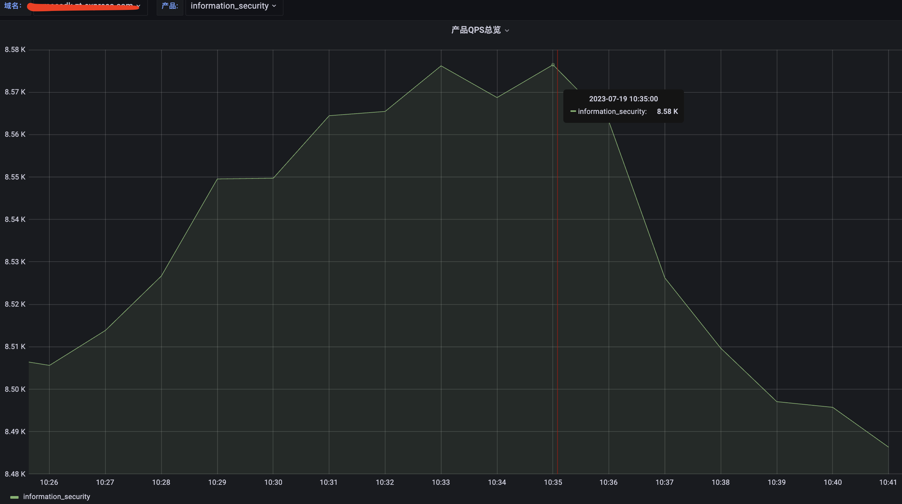
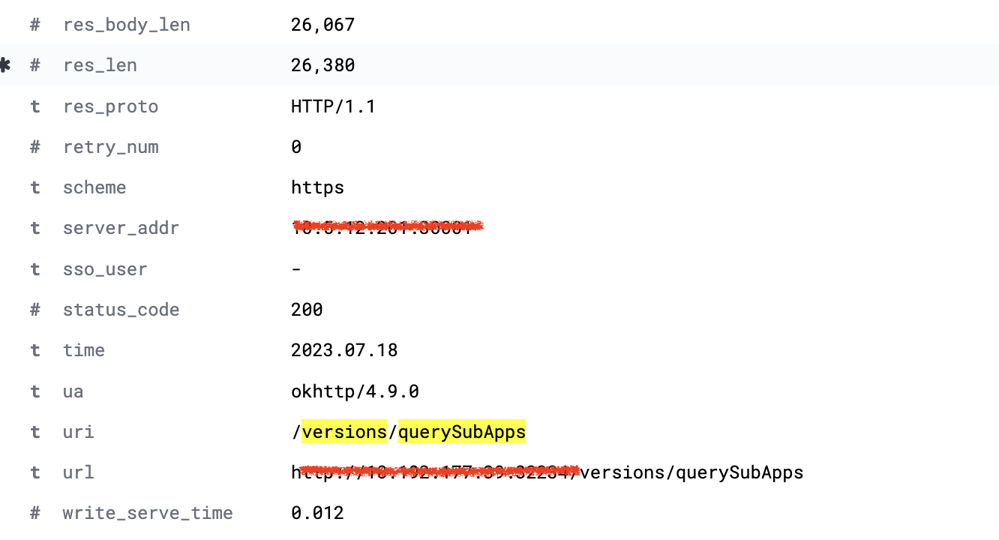
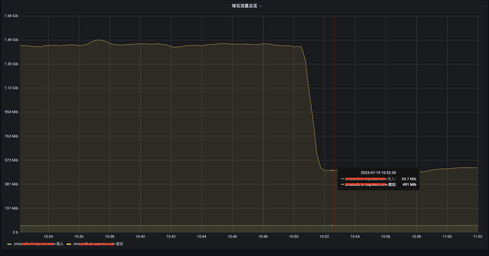

# 背景

某个集群需要进行资源整合下线，需要对集群上业务进行迁移，但在迁移某个带域名容器服务后，发现网络出口带宽升高了70%，域名带宽也一样增高。

- ingress: 0.32.0  迁移到 ingress :1.1.3
- kubernetes: 1.17.9 迁移到 kubernetes: 1.22.14

# 问题描述

1、域名出口带宽和机房出口带宽都同步增加了1G多，但请求量，Qps：~ 8k/s，没什么变化；域名状态也正常；业务也方反馈也没有出现明显异常。



2、迁移前后ingress-nginx-controller 版本是有一个升级的，0.32.0 -- > 1.1.3

# 根因分析

1、整个域名请求拓扑如下所示

xxx.ljohn.cn  -- > F5 -- > BFE(负载均衡) -- > Ingress -- > 容器pod

2、排查发现域名相应的body长度有所增加，同一个接口长度增加3倍，怀疑跟gzip压缩有关



3、于是联系最前端负载均衡是否有gzip压缩，从BFE负载均衡侧查询到是没有开启。

4、再然后查询ingress侧是否有开启gzip，发现老的ingress(0.32.0)是默认开启gzip

```
        gzip on;
        gzip_comp_level 5;
        gzip_http_version 1.1;
        gzip_min_length 256;
        gzip_types application/atom+xml application/javascript application/x-javascript application/json application/rss+xml application/vnd.ms-fontobject application/x-font-ttf application/x-web-app-manifest+json application/xhtml+xml application/xml font/opentype image/svg+xml image/x-icon text/css text/javascript text/plain text/x-component;
        gzip_proxied any;
        gzip_vary on;
```

新的ingress(1.1.3)，默认是没有这些配置，查看ingress-nginx当前官方文档发现默认是关闭的，至此问题应该是找到原因了。

> use-gzip
>
> Enables or disables compression of HTTP responses using the [&#34;gzip&#34; module](https://nginx.org/en/docs/http/ngx_http_gzip_module.html). MIME types to compress are controlled by [gzip-types](https://kubernetes.github.io/ingress-nginx/user-guide/nginx-configuration/configmap/#gzip-types). ***default:*** false

# 解决方案

1、ingress开启全局gzip （目前我们保持跟之前一致所有默认也开启了gzip。）

> a、注意开启是有一定性能损耗的，比如ingress cpu资源开销会上升。
>
> b、可能存在域名对应的服务端不支持gzip解压，可能会出现乱码，生产变更风险较大。

```
# 直接编辑全局ingress配置
kubectl -n ingress-nginx edit cm ingress-nginx-controller
apiVersion: v1
data:
  allow-snippet-annotations: "true"
  enable-real-ip: "true"
  gzip-level: "2"   # 新增 gzip压缩级别1-9
  use-gzip: "true"  # 新增 开启gzip 
# 容器发现配置变更会自动检查配置并reload
kubectl -n ingress-nginx exec -ti ingress-nginx-controller-588c895b4-wbclg -- cat nginx.conf > /tmp/nginx.conf | less 
...
        gzip on;
        gzip_comp_level 2;
        gzip_http_version 1.1;
        gzip_min_length 256;
        gzip_types application/atom+xml application/javascript application/x-javascript application/json application/rss+xml application/vnd.ms-fontobject application/x-font-ttf application/x-web-app-manifest+json application/xhtml+xml application/xml font/opentype image/svg+xml image/x-icon text/css text/javascript text/plain text/x-component;
        gzip_proxied any;
        gzip_vary on;
...


```

修改后效果，出口流量降低了1G



2、或者对单个ingress域名开启gzip，关闭gzip

```
# 直接编辑单个ingress 配置。
apiVersion: extensions/v1beta1
kind: Ingress
metadata:
  name: comptest-ingress
  annotations:
    nginx.ingress.kubernetes.io/server-snippet:  gzip on;  # 新增 开启gzip，关闭修改为 gzip off
```

# 参考

https://kubernetes.github.io/ingress-nginx/user-guide/nginx-configuration/configmap/#use-gzip

https://kubernetes.github.io/ingress-nginx/user-guide/nginx-configuration/configmap/#gzip-level
