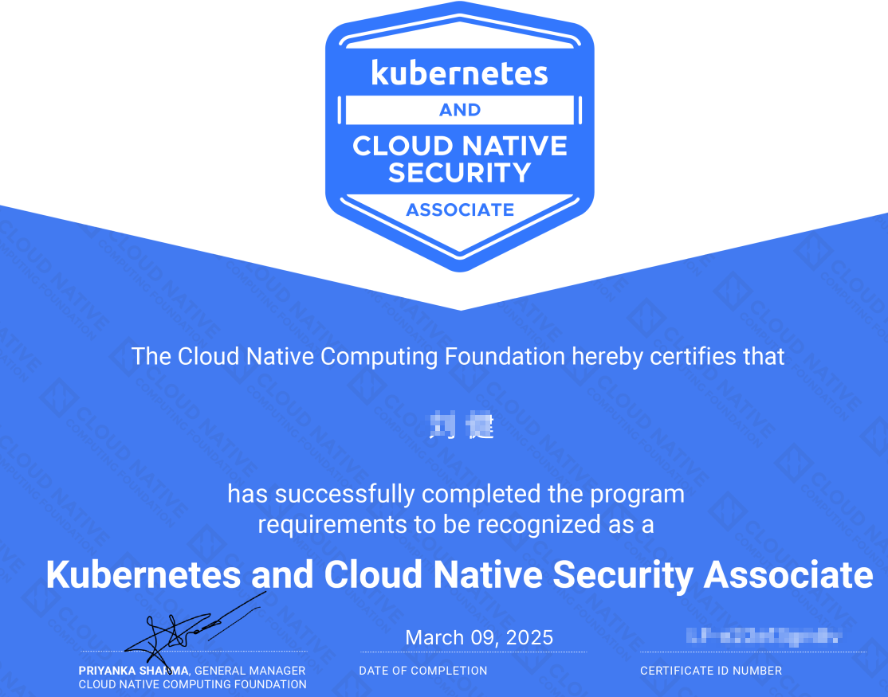

# 前言

该套题目是UDEMY上的一套题目《[**KCSA: Kubernetes & Cloud Native Security Associate EXAM-PREP**](https://www.udemy.com/course/kcsa-kubernetes-cloud-native-security-associate-exam-prep)》，我是通过淘宝购买优惠券，然后兑换购买了KCSA的练习题，总共120道题目，60到练习的，60到考试题目，不限次数的练习。

# 安全词汇

principle：原则

measure： 措施，方法

comprehensive： 综合，全面的

important： 重要的

compliance：合规

# What is the primary benefit of using immutable（不可变的） infrastructure in application code security?

**您的答案不正确**

**Storing configurations locally and securely**

**Allowing frequent manual changes**

**正确答案**

**Preventing configuration drift（防止配置漂移）**

**Regularly rebooting infrastructure components**

**总体解释**

**CORRECT ANSWER:**

**Preventing configuration drift** - Immutable infrastructure ensures that once an environment is deployed, it cannot be altered. This prevents configuration drift, where environments evolve from their original setup, often leading to security issues.

**WRONG ANSWERS:**

**Allowing frequent manual changes** - This undermines the immutability principle and increases the risk of misconfiguration.

**Storing configurations locally and securely** - While important, this is not the primary benefit of immutable infrastructure.

**Regularly rebooting infrastructure components** - Rebooting does not address security issues related to configuration drift.

# What is a comprehensive （全面）security measure for container runtime environments?

**正确答案**

**Using SELinux or AppArmor to restrict container privileges**

**Granting containers access to host-level namespaces**

**Allowing containers to access runtime APIs**

**您的答案不正确**

**Configuring Seccomp profiles to limit system calls for containers**

**总体解释**

**CORRECT ANSWER:**

**Using SELinux or AppArmor to restrict container privileges** - These tools enforce mandatory access controls to limit container actions, reducing the risk of privilege escalation and protecting the host.

**WRONG ANSWERS:**

**Granting containers access to host-level namespaces** - Weakens isolation and increases the risk of privilege escalation attacks.

**Configuring Seccomp profiles to limit system calls for containers** - A useful measure, but it focuses only on restricting system calls, not comprehensive privilege control.

**Allowing containers to access runtime APIs** - Increases attack vectors and creates potential vulnerabilities in the runtime environment.

# How does AppArmor enhance security for containers running in a Kubernetes environment?

**By adjusting（调整） user rights to grant additional privileges to container processes**

**正确答案**

**By defining a set of mandatory（强制） access control rules that restrict what processes within a container can do**

**By enforcing strict Pod Security Standards (PSS) and applying network policies to limit communication between pods**

**您的答案不正确**

**By filtering a process's system calls**

**总体解释**

**CORRECT ANSWER:**

**By defining a set of mandatory access control rules that restrict what processes within a container can do** - AppArmor uses mandatory access control (MAC) to restrict container actions.

**WRONG ANSWERS:**

**By filtering a process's system calls** - This describes seccomp, not AppArmor.

**By enforcing strict Pod Security Standards (PSS)** - AppArmor does not enforce Pod Security Standards.

**By adjusting user rights to grant additional privileges** - AppArmor restricts privileges rather than granting them.

# How can the `kubectl apply` command contribute to improving Kubernetes security?

**您的答案不正确**

**To delete misconfigured or insecure resources from the cluster**

**To roll back unauthorized changes to Kubernetes resources**

**正确答案**

**To apply updated RBAC roles and policies from configuration files**

**To generate encrypted secrets for Kubernetes resources**

**总体解释**

**CORRECT ANSWER:**

**To apply updated RBAC roles and policies** - `kubectl apply` creates or updates resources, including RBAC roles and bindings, ensuring proper access control.

**WRONG ANSWERS:**

**To roll back unauthorized changes to Kubernetes resources** - Rolling back changes is not the role of `kubectl apply`; this requires versioning tools like `kubectl rollout undo`.

**To generate encrypted secrets for Kubernetes resources** - Secrets are created via YAML or `kubectl create secret`, not directly encrypted using `kubectl apply`.

**To delete misconfigured or insecure resources from the cluster** - Deleting resources requires `kubectl delete`, not `kubectl apply`.

# How can a ReplicaSet contribute to the security of a Kubernetes application?

**DaemonSet**

**您的答案正确**

**By ensuring a certain number of pod replicas are running to slow down resource exhaustion due to denial-of-service attacks**

**Deployment**

**Service**

**总体解释**

**CORRECT ANSWER:**

**By ensuring a certain number of pod replicas are running to slow down resource exhaustion due to denial-of-service attacks** - ReplicaSets maintain pod availability, mitigating the impact of resource exhaustion attacks by ensuring new pods replace failed ones.

**WRONG ANSWERS:**

**By encrypting all traffic between replicated pods** - Traffic encryption is handled by tools like service meshes, not ReplicaSets.

**By isolating pods within unique namespaces** - Namespace isolation is unrelated to the ReplicaSet's role.

**By managing pod-level RBAC policies** - RBAC policies manage access, not pod replication, which is the responsibility of ReplicaSets.

# What is an easy way to find regularly appearing Vulnerabilities found in Kubernetes?

**您的答案不正确**

**Install the KubeSec helm chart in your cluster**

**正确答案**

**Go to the Official CVE Feed in the Kubernetes documentation**

**Go to `/var/lib/kubernetes/vulnerabilities` on any of the master nodes of your cluster**

**Use the `kubectl list vulnerabilities` command**

**总体解释**

**CORRECT ANSWER:**

**Go to the Official CVE Feed in the Kubernetes documentation** - The CVE feed provides regularly updated information about vulnerabilities in Kubernetes.

**WRONG ANSWERS:**

**Use the `kubectl list vulnerabilities` command** - There is no such command.

**Install the KubeSec helm chart in your cluster** - While KubeSec helps with security, it doesn't provide a list of vulnerabilities.

**Go to `/var/lib/kubernetes/vulnerabilities` on any of the master nodes of your cluster** - This directory path does not contain a vulnerability feed.

# Why is audit logging important in Kubernetes security?

**您的答案不正确**

**To facilitate auditing meetings at regular intervals for cluster admins, which is a best practice**

**正确答案**

**To track and log user actions within the cluster**

**To have a log of all audits that have been done on the cluster**

**To allow users access to logs so that they can troubleshoot their application**

**总体解释**

**CORRECT ANSWER:**

**To track and log user actions within the cluster** - Audit logging captures actions and changes, enhancing accountability and security.

**WRONG ANSWERS:**

**To allow users access to logs so that they can troubleshoot their application** - Audit logs are primarily for security, not troubleshooting.

**To facilitate auditing meetings at regular intervals for cluster admins** - Audits are ongoing, not just for meetings.

**To have a log of all audits that have been done on the cluster** - The focus is on logging user actions, not audits.

# How does the Kubernetes Scheduler contribute to cluster security?

**By monitoring for unauthorized access attempts and blocking them**

**正确答案**

**By scheduling pods on nodes according to Node Affinity rules, Node Anti-Affinity rules, Node taints, Node tolerations and resource constraints**

**您的答案不正确**

**By scheduling pods on nodes with the least number of vulnerabilities and enforcing runtime security policies**

**By enforcing resource quotas and blocking malicious pods**

**总体解释**

**CORRECT ANSWER:**

**By scheduling pods on nodes according to Node Affinity rules, Node Anti-Affinity rules, Node taints, Node tolerations and resource constraints** - The Kubernetes Scheduler assigns pods to nodes based on these factors, helping ensure the security and stability of the cluster by scheduling workloads appropriately.

**WRONG ANSWERS:**

**By scheduling pods on nodes with the least number of vulnerabilities and enforcing runtime security policies** - The Scheduler does not enforce vulnerability checks or runtime security policies.

**By enforcing resource quotas and blocking malicious pods** - Resource quotas are enforced by the API Server and resource controllers, not the Scheduler. And scheduler does not block malicious pods from running.

**By monitoring for unauthorized access attempts and blocking them** - Monitoring access attempts is handled by security tools, not the Scheduler.

# What is the purpose of the `kubernetes.io/enforce-mountable-secrets` annotation in Kubernetes?

**To prevent secrets from being mounted into a pod to reduce the risk of secret exposure**

**正确答案**

**To specify that secrets should be mounted into a pod only if they meet certain criteria defined by the annotation（指定仅当 secret 满足注释定义的某些条件时才将其挂载到 pod 中）**

**To ensure that secrets are encrypted when mounted into a pod, enhancing data security**

**您的答案不正确**

**To enforce that secrets can only be mounted into a pod as environment variables and not as files**

**总体解释**

**CORRECT ANSWER:**

**To specify that secrets should be mounted into a pod only if they meet certain criteria defined by the annotation** - The `kubernetes.io/enforce-mountable-secrets` annotation limits how and when secrets can be mounted into pods based on criteria.

**WRONG ANSWERS:**

**To ensure that secrets are encrypted when mounted into a pod** - Secrets are encrypted by default, and this annotation doesn't manage encryption.

**To enforce that secrets can only be mounted into a pod as environment variables** - This annotation doesn't enforce such restrictions.

**To prevent secrets from being mounted into a pod** - This annotation enforces conditions, not outright prevention.

# What is an important practice in Client Security when working with Kubernetes?

**正确答案**

**Securing your kubeconfig file**

**您的答案不正确**

**Using Kubernetes Secrets instead of Configmaps for confidential data**

**Keeping the cluster's nodes up-to-date**

**Scanning images in your container registry for vulnerabilities**

**总体解释**

**CORRECT ANSWER:**

**Securing your kubeconfig file** - The kubeconfig file contains sensitive information about access to your Kubernetes cluster and should be protected.

**WRONG ANSWERS:**

**Scanning images in your container registry for vulnerabilities** - This is important for image security but not directly related to client security.

**Keeping the cluster's nodes up-to-date** - Node updates are essential for cluster security but are not specifically related to client security.

**Using Kubernetes Secrets instead of Configmaps for confidential data** - This is important but pertains to data security, not client security.

# How can you bolster container runtime security within a Kubernetes cluster?

**Regularly rotating encryption keys to reduce risk of unauthorized access**

**您的答案不正确**

**Enabling `Secure execution` mode in the Container Runtime**

**Enabling debug mode to facilitate troubleshooting**

**正确答案**

**Implementing intrusion detection systems for threat detection**

**总体解释**

**CORRECT ANSWER:**

**Implementing intrusion detection systems for threat detection** - Intrusion detection systems monitor container activities to detect and alert on suspicious behaviors, enhancing runtime security.

**WRONG ANSWERS:**

**Enabling debug mode to facilitate troubleshooting** - Debug mode can expose sensitive information and should not be enabled in production environments.

**Regularly rotating encryption keys to reduce risk of unauthorized access** - Important for security but less directly related to container runtime security.

**Enabling `Secure execution` mode in the Container Runtime** - "Secure execution" mode does not exist across container runtimes. Although there are some secure execution environments called "sandbox".

# Which strategy helps minimize the damage（损害） potential（潜在） if an application component is compromised（受损的）?

**Disabling access controls**

**Only giving access to users that you are very familiar with**

**您的答案不正确**

**Consolidating all components into fewer services**

**正确答案**

**Implementing a least privilege model**

**总体解释**

**CORRECT ANSWER:**

**Implementing a least privilege model** - This strategy restricts access rights for users and components to the minimum necessary, reducing the potential damage if a component is compromised.

**WRONG ANSWERS:**

**Only giving access to users that you are very familiar with** - Familiarity does not ensure security; access controls should be defined by roles and responsibilities.

**Disabling access controls** - This exposes the application to greater risk by allowing unrestricted access.

**Consolidating all components into fewer services** - While it may simplify architecture, it can increase risk by creating single points of failure and complicating security management.

# Why is it not smart to store Kubernetes secrets in configmaps?

**正确答案**

**Kubernetes won't recognize or handle the sensitive data stored in configmaps as sensitive**

**There are no drawback to using configmaps to store secrets**

**Data in Configmaps are available to pods by populating a pod's volume, making them insecure**

**您的答案不正确**

**Data in Configmaps are unencrypted, while secrets are encrypted using Base64 and therefore more secure**

**总体解释**

**CORRECT ANSWER:**

**Kubernetes won't recognize or handle the sensitive data stored in configmaps as sensitive** - ConfigMaps are intended for non-sensitive data, and Kubernetes does not treat their contents with the same security as Secrets.

**WRONG ANSWERS:**

**Data in Configmaps are unencrypted, while secrets are encrypted using Base64 and therefore more secure** - Base64 encoding is not encryption; the main issue is how Kubernetes treats ConfigMaps versus Secrets.

**There are no drawbacks to using configmaps to store secrets** - ConfigMaps are not secure for storing sensitive data.

**Data in Configmaps are available to pods by populating a pod's volume, making them insecure** - This is a general usage feature but not the key reason for not storing secrets in ConfigMaps.

# Which configuration enhances（增强） the security of the Kubernetes API Server against （拒绝反对）unauthorized access?

**正确答案**

**Implementing Role-Based Access Control (RBAC) with least privilege**

**Configuring permissive network policies to simplify access management**

**Enabling all API Server features to ensure compatibility**

**您的答案不正确**

**Setting up broad access controls to minimize connectivity issues**

**总体解释**

**CORRECT ANSWER:**

**Implementing Role-Based Access Control (RBAC) with least privilege** - RBAC ensures that users and components have only the permissions they need, minimizing the risk of unauthorized access to the Kubernetes API Server.

**WRONG ANSWERS:**

**Configuring permissive network policies to simplify access management** - Permissive policies increase exposure and reduce security.

**Enabling all API Server features to ensure compatibility** - Enabling unnecessary features may increase the attack surface.

**Setting up broad access controls to minimize connectivity issues** - Broad access controls may allow unauthorized access, compromising security.

# How can understanding trust boundaries help improve security in a Kubernetes cluster?

**您的答案不正确**

**By preventing communication between components for enhanced security**

**By enabling security policies to reduce malicious activities**

**正确答案**

**By identifying and segmenting（划分） different parts of the cluster to limit the impact of a security breach**

**By merging namespaces into larger namespace to simplify management**

**总体解释**

**CORRECT ANSWER:**

**By identifying and segmenting different parts of the cluster to limit the impact of a security breach** - Understanding trust boundaries helps contain security breaches within certain parts of the cluster.

**WRONG ANSWERS:**

**By preventing communication between components** - Trust boundaries don’t prevent necessary communication but segment it securely.

**By merging namespaces into larger namespaces** - This would reduce security, not improve it.

**By enabling security policies to reduce malicious activities** - While true, this is not specific to the role of trust boundaries.

# What are some possible settings that a security context can define for a Pod or a container?

**正确答案**

**User ID, Group ID and Privilege**

**您的答案不正确**

**Linux privileges, Secret Management**

Linux privileges is correct, Secret Management is not correct

**AppArmor, Linux Namespace**

AppArmor is correct, linux namespace are a feature of the Linux kernel

**Seccomp, confidentiality**

Seccomp is correct, confidentiality is not a setting

**总体解释**

**CORRECT ANSWER:**

**User ID, Group ID and Privilege** - Security contexts define the user and group ID under which a pod or container runs and can manage privilege escalation.

**WRONG ANSWERS:**

**AppArmor, Linux Namespace** - These are security tools, but not the core elements of a security context definition.

**Seccomp, confidentiality** - Seccomp is part of security settings, but confidentiality is not directly controlled by security contexts.

**Linux privileges, Secret Management** - Security context manages user and group IDs, but not secret management.

# What role does Public Key Infrastructure (PKI) play in securing a Kubernetes cluster?

**It simplifies the process of key management by automating key rotation**

**您的答案不正确**

**It allows for the use of self-signed certificates for internal services**

**It replaces the need for authentication tokens**

**正确答案**

**It enables secure communication through the issuance（颁发） and management of certificates**

**总体解释**

**CORRECT ANSWER:**

**It enables secure communication through the issuance and management of certificates** - PKI helps in securing communication within the Kubernetes cluster by managing certificates for encryption and identity verification.

**WRONG ANSWERS:**

**It replaces the need for authentication tokens** - PKI works alongside tokens, not as a replacement.

**It simplifies the process of key management by automating key rotation** - PKI doesn’t inherently automate key rotation, though it facilitates key management.

**It allows for the use of self-signed certificates for internal services** - Self-signed certificates can be used but aren't a primary function of PKI.

**问题 17**

# Which authentication method is a recommended enhancement for Kubernetes API server?

**Implementing SHA-1 authentication**

**Implementing A/B authentication**

**正确答案**

**Implementing OAuth2 tokens**

**您的答案不正确**

**Making the cluster private**

**总体解释**

**CORRECT ANSWER:**

**Implementing OAuth2 tokens** - OAuth2 tokens provide a modern, secure method for API server authentication.

**WRONG ANSWERS:**

**Implementing A/B authentication** - This is not a recognized authentication method for Kubernetes.

**Implementing SHA-1 authentication** - SHA-1 is outdated and insecure.

**Making the cluster private** - This improves network security but does not directly enhance authentication.

# How can the OWASP Kubernetes Top Ten guide be utilized to improve security in a Kubernetes environment?

**您的答案不正确**

**By verifying all software components, including third-party libraries, before deployment to maintain supply chain compliance**

**By applying threat modeling frameworks to identify potential attack vectors and implement mitigation strategies**

**正确答案**

**By identifying and mitigating（减缓） common security risks and vulnerabilities specific to Kubernetes**

**By ensuring Kubernetes aligns with compliance frameworks through strict access controls and audit logging**

**总体解释**

**CORRECT ANSWER:**

**By identifying and mitigating common security risks and vulnerabilities specific to Kubernetes** - The OWASP Kubernetes Top Ten guide helps mitigate common security risks in Kubernetes environments.

**WRONG ANSWERS:**

**By applying threat modeling frameworks** - While important, this isn't specific to the OWASP guide's purpose.

**By verifying all software components** - This is more related to supply chain security, not the focus of OWASP Kubernetes Top Ten.

**By ensuring Kubernetes aligns with compliance frameworks** - The OWASP guide is about security vulnerabilities, not compliance alignment.

# What are four common container runtimes?

**Containerd, CRI-O, Docker Engine, gRPC**

**正确答案**

**Containerd, CRI-O, Docker Engine, Mirantis**

**您的答案不正确**

**Containerd, CRI-O, Docker Engine, Vitess**

**OCI, CRI-O, Docker Engine, Envoy**

**总体解释**

**CORRECT ANSWER:**

**Containerd, CRI-O, Docker Engine, Mirantis** - These are well-known container runtimes used in Kubernetes environments.

**WRONG ANSWERS:**

**OCI, CRI-O, Docker Engine, Envoy** - OCI is a standard, and Envoy is a service proxy, not a container runtime.

**Containerd, CRI-O, Docker Engine, gRPC** - gRPC is a communication protocol, not a container runtime.

**Containerd, CRI-O, Docker Engine, Vitess** - Vitess is a database solution, not a container runtime.

# What security function does the Container Runtime Interface (CRI) enable in Kubernetes?

**正确答案**

**Facilitating（促进） container isolation by supporting security policies like Seccomp and AppArmor through the runtime**

**Managing network policies between container runtimes**

**Providing direct control over container runtime security settings via the API Server**

**您的答案不正确**

**Enabling encrypted communication between the kubelet and container runtime**

**总体解释**

**CORRECT ANSWER:**

**Facilitating container isolation by supporting security policies like Seccomp and AppArmor through the runtime** – The CRI allows the kubelet to communicate with container runtimes and apply isolation policies such as Seccomp and AppArmor, which help control system call access and resource restrictions, enhancing container security.

**WRONG ANSWERS:**

**Enabling encrypted communication between the kubelet and container runtime** – While the CRI manages communication between the kubelet and container runtime, encryption is handled by other layers like TLS, not by the CRI itself.

**Managing network policies between container runtimes** – CRI is responsible for container management and lifecycle operations, not network policies, which are handled by network plugins or policies in Kubernetes.

**Providing direct control over container runtime security settings via the API Server** – The CRI does not provide direct security management through the API Server. Security settings are managed through security contexts or Pod Security Admission, not directly through CRI.

# What is the purpose of the kube-bench tool in Kubernetes security?

To manage Kubernetes secrets

您的答案不正确
To benchmark Kubernetes cluster performance

To monitor network traffic in the cluster

正确答案
To check Kubernetes clusters against CIS benchmarks

总体解释
CORRECT ANSWER:

To check Kubernetes clusters against CIS benchmarks - kube-bench assesses cluster configurations against CIS security benchmarks.

WRONG ANSWERS:

To benchmark Kubernetes cluster performance - kube-bench focuses on security, not performance.

To monitor network traffic in the cluster - This is handled by monitoring tools like Prometheus or network analyzers.

To manage Kubernetes secrets - Secrets are managed using kubectl and Kubernetes APIs, not kube-bench.

# Which Kubernetes object is used to expose a set of pods as a network service?

Deployment

您的答案不正确
Ingress

ConfigMap

正确答案
Service

总体解释
CORRECT ANSWER:

Service - A Service in Kubernetes defines a logical set of pods and a policy for accessing them, providing a stable endpoint for clients.

WRONG ANSWERS:

ConfigMap - Used to store non-sensitive configuration data.

Ingress - Manages external HTTP/S access to services.

Deployment - Manages the deployment and scaling of pods but does not expose them as a network service.

# How can you ensure that a container runs with non-root user privileges in Kubernetes?

正确答案
By modifying the 'runAsUser' field in the Pod security context YAML configuration

By mounting a PersistentVolume to the pod by modifying the pod's YAML configuration

By adding a Service Account and using it in the pod's YAML configuration

您的答案不正确
By adding a label [policies.kubernetes.io/runAsRoot:](http://policies.kubernetes.io/runAsRoot:) false  to the pod

总体解释
CORRECT ANSWER:

By modifying the 'runAsUser' field in the Pod security context YAML configuration - Setting 'runAsUser' ensures the container runs as a non-root user.

WRONG ANSWERS:

By adding a Service Account and using it in the pod's YAML configuration - Service Accounts manage API access, not container user privileges.

By mounting a PersistentVolume to the pod by modifying the pod's YAML configuration - This handles storage, not user privileges.

By adding a label [policies.kubernetes.io/runAsRoot:](http://policies.kubernetes.io/runAsRoot:) false to the pod - Labels don't enforce security context settings.

# Which framework is commonly used to standardize cloud security controls?

**您的答案不正确**

**PCI-DSS**

**GDPR**

**正确答案**

**ISO 27001**

**OWASP Top 10**

**总体解释**

**CORRECT ANSWER:**

**ISO 27001** - ISO 27001 is a widely recognized framework for standardizing cloud security controls. It provides a comprehensive set of guidelines for establishing, implementing, maintaining, and continually improving an information security management system.

**WRONG ANSWERS:**

**PCI-DSS** - Targets payment card industry data security, not general cloud security controls.

**OWASP Top 10** - Lists common web application vulnerabilities but does not provide a standard framework for cloud security.

**GDPR** - Focuses on data protection and privacy regulations in the EU, not on standardizing security controls.

# How can you ensure that a container runs with non-root user privileges in Kubernetes?

正确答案
By modifying the 'runAsUser' field in the Pod security context YAML configuration

By mounting a PersistentVolume to the pod by modifying the pod's YAML configuration

By adding a Service Account and using it in the pod's YAML configuration

您的答案不正确
By adding a label [policies.kubernetes.io/runAsRoot:](http://policies.kubernetes.io/runAsRoot:) false  to the pod

# What is a crucial security measure for managing container images?

Allowing all users to pull images

正确答案
Storing images in a private repository

您的答案不正确
Allowing all users to push images

Using images from public, recognized registries

总体解释
CORRECT ANSWER:

Storing images in a private repository - Using a private repository allows you to control access to container images, enhancing security by preventing unauthorized use and reducing the risk of compromised images.

WRONG ANSWERS:

Using images from public, recognized registries - Public registries are accessible to everyone and may contain untrusted images.

Allowing all users to push images - This can introduce security risks by allowing potentially malicious images to be added.

Allowing all users to pull images - Unrestricted access may expose sensitive images to unauthorized users.

# Which tool helps to ensure the integrity of container images?

Thanos

Kyverno

您的答案不正确
Shielder

正确答案
Notary

总体解释
CORRECT ANSWER:

Notary - Notary ensures the integrity of container images through signing and verification, confirming that images are from trusted sources and have not been tampered with.

WRONG ANSWERS:

Shielder - Not a standard tool for ensuring container image integrity.

Thanos - Used for scaling Prometheus data, not for image integrity.

Kyverno - A policy engine for Kubernetes, but not specifically focused on image integrity.

# How did a user with full CRUD rights on a namespace allow a privileged pod to run even when it is being disallowed by the Pod Security Admission controller?

The pod already has the necessary rights to run privileged containers since the user has full CRUD rights

您的答案不正确
The user got client certificates from another namespace with higher credentials

The user added a label on the pod

正确答案
The user removed a label on the namespace

总体解释
CORRECT ANSWER:
The user removed a label on the namespace - Removing the Pod Security Admission label can bypass the restrictions set by the Pod Security Admission controller, allowing the privileged pod to run.

WRONG ANSWERS:
The user got client certificates from another namespace with higher credentials - Client certificates do not directly affect Pod Security Admission policies or permissions for running privileged pods.

The pod already has the necessary rights to run privileged containers since the user has full CRUD rights - CRUD rights on a namespace do not override Pod Security Admission policies.

The user added a label on the pod - Labels on pods do not bypass namespace-level security policies enforced by the Pod Security Admission controller.

# How do you disallow privileged pods from running in a namespace when using Pod Security Standards?

正确答案
Add [pod-security.kubernetes.io/enforce:](http://pod-security.kubernetes.io/enforce:) baseline label to the namespace

Change the Security Context of the pods

Add a LimitRange resource to the namespace

您的答案不正确
Add [pod-security.kubernetes.io/privileged:](http://pod-security.kubernetes.io/privileged:) false label to the namespace

总体解释
CORRECT ANSWER:
Add [pod-security.kubernetes.io/enforce:](http://pod-security.kubernetes.io/enforce:) baseline label to the namespace - This label enforces the Baseline Pod Security Standard, which disallows privileged pods in the namespace.

WRONG ANSWERS:
Add [pod-security.kubernetes.io/privileged:](http://pod-security.kubernetes.io/privileged:) false label to the namespace - This label does not exist and would not be effective for controlling privileged pod access.

Change the Security Context of the pods - Modifying the Security Context affects individual pods, not the entire namespace.

Add a LimitRange resource to the namespace - LimitRange controls resource limits and requests, not pod security standards.

# What Kubernetes object can be used to control which nodes a pod can be scheduled on?

Affinity

您的答案不正确
NodeSelector

Taint

正确答案
All of the other answers

总体解释
CORRECT ANSWER:

All of the other answers - NodeSelector, Taints/Tolerations, and Affinity rules are all used to control which nodes a pod can be scheduled on.

WRONG ANSWERS:

NodeSelector - Correct but only one method; 'All of the other answers' includes this and more.

Taint - Correct but only part of the solution.

Affinity - Correct but not the only method.

# What command checks the enforced Pod Security Standard level in a Kubernetes namespace?

您的答案不正确
kubectl get podsecuritypolicies -n `<namespace>`

正确答案
kubectl get ns --show-labels -n `<namespace>`

kubectl get roles -n `<namespace>`

kubectl get networkpolicies -n `<namespace>`

总体解释
CORRECT ANSWER:

kubectl get ns --show-labels -n `<namespace>` - This command lists namespaces with their associated labels, including Pod Security Admission labels like [pod-security.kubernetes.io/enforce](http://pod-security.kubernetes.io/enforce).

WRONG ANSWERS:

kubectl get roles -n `<namespace>` - This command is used to list roles in the cluster, not to view Pod Security labels.

kubectl get networkpolicies -n `<namespace>` - This command is used to view network policies, not Pod Security Standards labels.

kubectl get podsecuritypolicies -n `<namespace>` - While this command is related to Pod Security Policies, PSPs are deprecated and replaced by Pod Security Admission (PSA), which uses namespace labels.

# What is trojan classified as in the STRIDE threat model?

Repudiation

Elevation of Privilege

正确答案
Spoofing

您的答案不正确
Tampering

总体解释
CORRECT ANSWER:

Spoofing - In the STRIDE threat model, a trojan is classified under Spoofing because it disguises itself as legitimate software to deceive users or systems.

WRONG ANSWERS:

Tampering - Tampering involves unauthorized modification of data, which is not the primary characteristic of a trojan.

Repudiation - Repudiation refers to the denial of actions or transactions, which does not apply to trojans.

Elevation of Privilege - While trojans may lead to elevated privileges, their main tactic is deception, aligning them with Spoofing.

# Which one of these statements are true about Kubernetes configmaps?

您的答案不正确
ConfigMaps can only be accessed by the Kubernetes API server, ensuring that the data is secure

正确答案
ConfigMaps store data in plain text, which can be easily read by anyone with access to the ConfigMap, leading to potential security breaches

ConfigMaps are designed to store sensitive information securely and are preferred over Secrets for this purpose

ConfigMaps automatically encrypt the data they store, so passwords are safe from unauthorized access

总体解释
CORRECT ANSWER:

ConfigMaps store data in plain text, which can be easily read by anyone with access to the ConfigMap, leading to potential security breaches - ConfigMaps store configuration data in plain text. If sensitive information like passwords is stored in a ConfigMap, anyone with access to it can read the data, posing a security risk.

WRONG ANSWERS:

ConfigMaps automatically encrypt the data they store, so passwords are safe from unauthorized access - ConfigMaps do not provide encryption; they store data in plain text without any built-in security mechanisms.

ConfigMaps can only be accessed by the Kubernetes API server, ensuring that the data is secure - ConfigMaps can be accessed by any user or pod with the appropriate permissions, not just the API server.

ConfigMaps are designed to store sensitive information securely and are preferred over Secrets for this purpose - Secrets are intended for sensitive information, as they store data in a base64-encoded format and can be encrypted at rest, making them more secure than ConfigMaps.

# Your single node API Server is running on one control plane and is hit by a DDOS attack, how does running more nodes on the control plane help?

Automatically blocks all DDoS traffic once multiple API Servers detect unusual activity

您的答案不正确
More nodes on the control plane makes the API Server momentarily responsive, which supports preventative measures

正确答案
Distributes the attack load, increases resiliency and reduces likelihood of a single point of failure

Isolates the attack to one API Server, and since there are more API Servers it prevents the attack from spreading

总体解释
CORRECT ANSWER:

Distributes the attack load, increases resiliency and reduces likelihood of a single point of failure - Running more nodes on the control plane helps distribute the load from a DDoS attack across multiple API Servers, enhancing resiliency and reducing the risk of a single point of failure.

WRONG ANSWERS:

Isolates the attack to one API Server, and since there are more API Servers it prevents the attack from spreading - Adding more API Servers does not isolate the attack to one server; the attack traffic is still directed at the control plane.

Automatically blocks all DDoS traffic once multiple API Servers detect unusual activity - Kubernetes does not automatically block DDoS traffic; additional security measures are required to detect and mitigate such attacks.

More nodes on the control plane makes the API Server momentarily responsive, which supports preventative measures - Adding nodes increases capacity but does not make the API Server momentarily responsive to support preventative measures during an ongoing attack.

# Which cloud infrastructure security feature ensures encrypted data transfer between services?

您的答案不正确
Identity and Access Management (IAM)

Data Loss Prevention (DLP)

正确答案
Transport Layer Security (TLS)

Key Management Service (KMS)

总体解释
CORRECT ANSWER:

Transport Layer Security (TLS) - TLS ensures encrypted data transfer between services in the cloud by encrypting data in transit, protecting it from interception and tampering.

WRONG ANSWERS:

Identity and Access Management (IAM) - IAM manages user identities and permissions but does not encrypt data transfer.

Data Loss Prevention (DLP) - DLP focuses on preventing data leaks, not on encrypting data between services.

Key Management Service (KMS) - KMS manages encryption keys but does not directly handle data encryption during transfer.

# What controllers except kube-controller are also a built-in part of kubernetes?

ReplicaSet controller, pod controller, cronjob controller

Replicaset controller, pod controller, daemonset controller

您的答案不正确
Ingress controller, pod controller, DaemonSet controller

正确答案
DaemonSet Controller, Deployment Controller, StatefulSet Controller

总体解释
CORRECT ANSWER:

DaemonSet Controller, Deployment Controller, StatefulSet Controller - These are built-in Kubernetes controllers that manage DaemonSets, Deployments, and StatefulSets, handling the creation and maintenance of these resources.

WRONG ANSWERS:

ReplicaSet controller, pod controller, cronjob controller - While the ReplicaSet and CronJob controllers are built-in, there is no dedicated "pod controller" in Kubernetes.

Ingress controller, pod controller, DaemonSet controller - The Ingress controller is not built-in; it typically requires third-party implementations. There is also no "pod controller".

ReplicaSet controller, pod controller, DaemonSet controller - Although ReplicaSet and DaemonSet controllers are built-in, Kubernetes does not include a separate "pod controller".

# Which control framework focuses on managing and mitigating risks in a cloud environment?

CIS Controls

您的答案不正确
SOC 2

正确答案
NIST Cybersecurity Framework

HIPAA

总体解释
CORRECT ANSWER:

NIST Cybersecurity Framework - The NIST Cybersecurity Framework provides guidelines and best practices for organizations to manage and mitigate cybersecurity risks, including those in cloud environments. It offers a comprehensive approach to identify, protect, detect, respond to, and recover from cyber threats.

WRONG ANSWERS:

HIPAA - HIPAA focuses on protecting the privacy and security of health information in the healthcare industry, not on general risk management in cloud environments.

SOC 2 - SOC 2 provides criteria for evaluating the security, availability, and confidentiality of service providers but does not specifically focus on managing and mitigating risks in cloud environments.

CIS Controls - The CIS Controls offer specific actionable recommendations to stop today's most pervasive and dangerous cyber attacks but are not a comprehensive framework for risk management.

# What security principle does "The 4C’s of Cloud Native Security" modify?

Open Design

Least Privilege

您的答案不正确
Zero Trust

正确答案
Defense in Depth

总体解释
CORRECT ANSWER:

Defense in Depth - The 4Cs of Cloud Native Security emphasize applying multiple layers of security controls to protect cloud-native applications, which aligns with the Defense in Depth principle. This principle involves implementing various security measures to safeguard against potential threats.

WRONG ANSWERS:

Least Privilege - Focuses on giving the minimum permissions necessary for users or systems, which is about access control rather than layering multiple security measures.

Zero Trust - A security model that assumes no inherent trust and requires verification for every access request, but it’s a broader concept that isn't specifically about layering security controls.

Open Design - Promotes transparency and openness in security design, but does not specifically address the concept of multiple layers of security like Defense in Depth.
