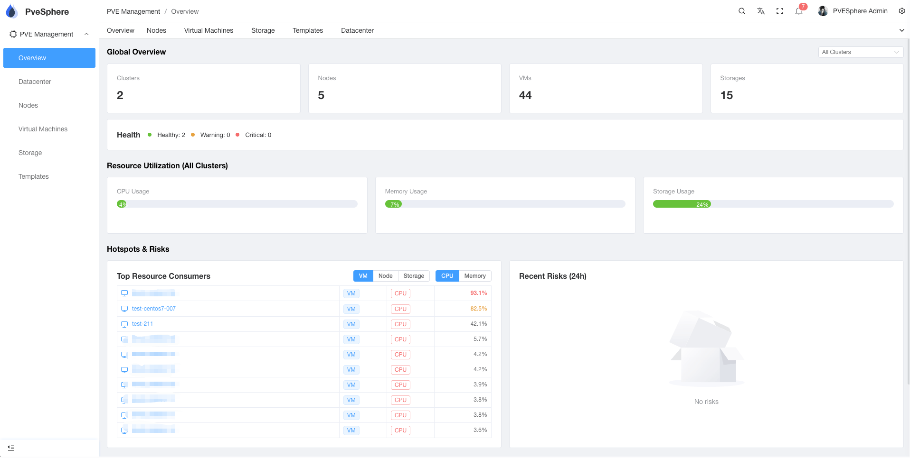

## 引言

如果你正在使用 Proxmox VE（PVE）管理虚拟化基础设施，并且运维着不止一个集群，那么你一定深有体会：在多个 Web 界面之间频繁切换、手动同步虚拟机模板、难以获得资源使用的全局视图……这些重复性工作不仅效率低下，还容易出错。

今天，我要向你介绍一个开源项目 —— **PveSphere**，它专为解决 Proxmox VE 多集群管理痛点而生，让你的运维工作变得优雅而高效。

## 什么是 PveSphere？

PveSphere 是一个基于 Web 的 Proxmox VE 多集群管理平台。它提供了统一的控制面板，让你能够从单一界面管理多个 PVE 集群、节点、虚拟机、存储和模板。



## 为什么需要 PveSphere？

### 你是否遇到过这些问题？

虽然 Proxmox VE 是一个强大的开源虚拟化平台，但在管理多集群时往往面临诸多挑战：

- **多集群管理繁琐**：管理多个集群时需要在不同的 PVE Web 界面之间频繁切换
- **缺乏统一监控**：难以获得跨所有集群的资源全局视图
- **模板同步耗时**：手动在节点间同步虚拟机模板既费时又容易出错
- **操作复杂度高**：跨集群管理虚拟机、存储和备份需要频繁切换上下文

PveSphere 通过提供**集中式管理平台**解决了这些问题，简化了多集群操作，大幅提升了运维效率。

## PveSphere 解决的核心问题

### 🎯 核心痛点

1. **多集群管理**：统一界面管理多个 PVE 集群，无需在不同的 Web UI 之间切换
2. **资源可见性**：从单一控制面板实时监控所有集群、节点、虚拟机和存储
3. **模板管理**：自动化的模板同步功能，支持共享存储和本地存储
4. **简化操作**：简化虚拟机生命周期管理、迁移、备份和监控的工作流程
5. **更好的用户体验**：现代化、响应式的 Web 界面，比原生 PVE 界面更易用

### 🔍 具体应用场景

- **跨地域集群管理**：管理分布在不同位置或环境的多个 PVE 集群
- **集中监控告警**：为 PVE 基础设施提供集中化监控和告警
- **自动模板分发**：自动化的跨节点模板分发
- **简化虚拟机供给**：简化虚拟机创建和管理工作流程
- **容量规划**：更好的资源可见性，助力容量规划

## 谁应该使用 PveSphere？

### ✅ 适合的用户群体

- **多集群运维人员**：管理多个 PVE 集群，需要集中管理的团队
- **中小型团队**：希望简化 PVE 操作的小型 DevOps 团队
- **模板密集型环境**：频繁从模板部署虚拟机，需要自动同步的用户
- **关注资源监控**：需要更好地了解跨集群资源使用情况的团队
- **开源爱好者**：偏好开源解决方案，希望避免厂商锁定的用户

### ❌ 可能不适合的场景

- **单集群用户**：如果只管理一个 PVE 集群，原生 PVE Web 界面可能就够用
- **大规模需求**：已经在运营大规模 OpenStack 环境的团队
- **复杂高可用场景**：高级的高可用和灾难恢复需求可能需要专用工具
- **纯 API 用户**：如果主要通过 API/CLI 与 PVE 交互，可能不需要 Web 管理界面

## 真实场景示例

### 场景一：多环境管理

你运行着开发、测试和生产三个 PVE 集群。使用 PveSphere，你不再需要登录三个不同的 PVE Web 界面，而是可以从统一的控制面板管理所有环境。

### 场景二：模板分发

你有存储在本地的虚拟机模板，需要在多个节点上使用。PveSphere 自动化了同步过程，为你节省了数小时的手动操作时间。

### 场景三：资源监控

你需要监控多个集群的资源使用情况，以识别热点并规划容量。PveSphere 提供了 CPU、内存和存储使用情况的集中视图。

### 场景四：简化虚拟机操作

你的团队频繁在集群间创建、迁移和管理虚拟机。PveSphere 提供简化的界面，减少了所需的点击次数和上下文切换。

## 核心功能

- **多集群控制面板**：实时概览所有集群、节点、虚拟机和存储资源
- **集群管理**：添加和管理多个 PVE 集群，集中配置
- **虚拟机生命周期管理**：创建、启动、停止、迁移、备份和恢复虚拟机
- **模板管理**：跨节点导入、同步和管理虚拟机模板
- **存储管理**：监控存储使用情况，管理存储池
- **节点管理**：监控节点，通过终端代理访问节点控制台
- **虚拟机控制台访问**：提供 VNC/NoVNC 控制台访问
- **资源监控**：实时指标和使用率跟踪

## 快速开始

### 系统要求

- Docker >= 20.10
- Docker Compose >= 2.0

### 使用 Docker 快速启动

```bash
# 克隆仓库
git clone https://github.com/pvesphere/pvesphere.git
cd pvesphere

# 构建并启动所有服务
make docker-compose-build

# 查看服务日志
make docker-compose-logs

# 停止所有服务
make docker-compose-down
```

### 默认登录凭据

首次启动后，使用以下凭据登录：
- **邮箱**：`pvesphere@gmail.com`
- **密码**：`Ab123456`

> ⚠️ 请在首次登录后立即更改默认密码。

### 访问服务

- **API 服务**：http://localhost:8000
- **API 文档**：http://localhost:8000/swagger/index.html

详细的安装和配置说明，请访问：[https://docs.pvesphere.com](https://docs.pvesphere.com)

## 未来规划

PveSphere 的开发理念是**稳定性和正确性优先于功能速度**。以下是计划中的改进：

### 核心改进

- **改进的模板生命周期跟踪**：增强整个生命周期中模板状态的可见性和管理
- **更安全的多集群编排**：跨多集群管理资源时更稳健可靠的操作
- **增强的自动化工作流**：简化常见运维任务的自动化能力
- **更好的可观测性和可审计性**：全面的监控、日志记录和审计追踪

### 计划功能

- **高级存储管理**：更全面的存储操作和管理能力
- **集群级虚拟机调度**：集群级别的智能虚拟机放置和调度机制
- **DRS（分布式资源调度器）**：动态资源重平衡的二级调度能力
- **基于角色的访问控制（RBAC）**：细粒度的访问控制和权限管理
- **扩展监控和日志**：增强的监控能力和全面的日志管理

> **注意**：路线图优先考虑稳定性和正确性。功能将在经过充分测试并准备好用于生产环境后发布，而不是基于任意的时间表。


## 结语

如果你正在寻找一个简单、高效、开源的 Proxmox VE 多集群管理解决方案，PveSphere 值得一试。它不仅能帮你节省大量的运维时间，还能让你的基础设施管理变得更加优雅。

立即访问 [GitHub 仓库](https://github.com/pvesphere/pvesphere)，开始体验 PveSphere 带来的便利吧！

### 联系方式

- **邮箱**：pvesphere@gmail.com
- **Twitter**：[@PveSphere](https://x.com/PveSphere)
- **GitHub**：[https://github.com/pvesphere/pvesphere](https://github.com/pvesphere/pvesphere)
- **文档**：[https://docs.pvesphere.com](https://docs.pvesphere.com)

### PveSphere 技术交流群

欢迎加入 PveSphere 技术交流群，与其他用户和开发者一起交流使用经验、分享最佳实践。

- **微信群**：添加微信号 `pvesphere` 备注「PveSphere」入群讨论

*本文由 PveSphere 社区编写，遵循 Apache License 2.0 许可证*
