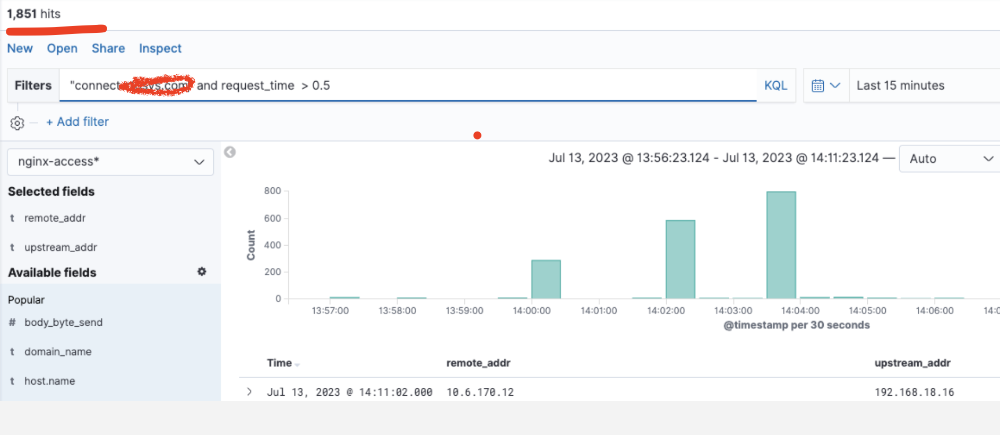

# 环境信息

- os： centos7.9
- kernel：3.10.0-1160.59.1.el7.x86_64
- k8s：v1.17.16
- nginx-ingress-controller：0.32.0

# 问题描述

1、2023.7.13，下午接到监控同学反馈部分网关域名14:00有少量请求耗时大于500ms。初步查看所有异常域名均指向在一个网关专有容器集群中。



2、查看ingress该时间点出现过配置reload，并且看到有个 ingress pod重启过。


# 根因分析

1、从如上问题描述和现象来看，正常nginx 或者ingress 配置reload 都是热更新，不应该存在阻塞，导致重启。

于是查看该容器详情如下：`kubectl -n ingress-nginx describe pod ingress-nginx-controller-864979f685-clfqw`


2、查看容器重启前日志：`kubectl -n ingress-nginx logs -p ingress-nginx-controller-864979f685-clfqw`

从pod最后14:02 日志来看，ingress 意外shutdown了，非预期的中期导致部分流量进到该容器中，致使这些域名出现耗时增大问题。


3、这些都是结果，是什么原因导致了这个ingress 出现了非预期的shutdown呢？

继续向上翻阅日志查看到了一些蛛丝马迹，结果发现14:01分有无法创建线程报错：`2023/07/13 06:01:44 [alert] 17406#17406: pthread_create() failed (11: Resource temporarily unavailable)`


到这里，问题根因找到了，又是因为主机pid_max太小，cgroup中pid_max 也太小，主机上创建的线程太多，在ingress 容器reload时出现创建线程异常后，ingress才出现非预期的shutdown。这个问题之前[calico-node异常](https://www.ljohn.cn/posts/d62f787/)也出现过。该死! 这个集群变更还没安排到。

```
# 查看cgroup pid_max值
cat /sys/fs/cgroup/pids/kubepods/pids.max
49152
# 查看当前使用值,使用率很高
cat /sys/fs/cgroup/pids/kubepods/pids.current
42396
```

# 解决方案

这里参考calico-node异常重启修改办法如下：

```
# 临时修改kubepods cgroup 的pids.max 
echo "1000000" > /sys/fs/cgroup/pids/kubepods/pids.max

# 永久生效
# 再查看系统的pid_max值，这个值是修改过，但是没有重启过kubelet服务，所以k8s没识别到该该系统参数。
echo "1000000" > /proc/sys/kernel/pid_max
echo 'kernel.pid_max=1000000' >> /etc/sysctl.conf
# 或者，这里只需要重启kubelet即可自动保持pids.max和kernel.pid_max值一致
systemctl restart kubelet
```

# 参考

https://www.ljohn.cn/posts/d62f787/
