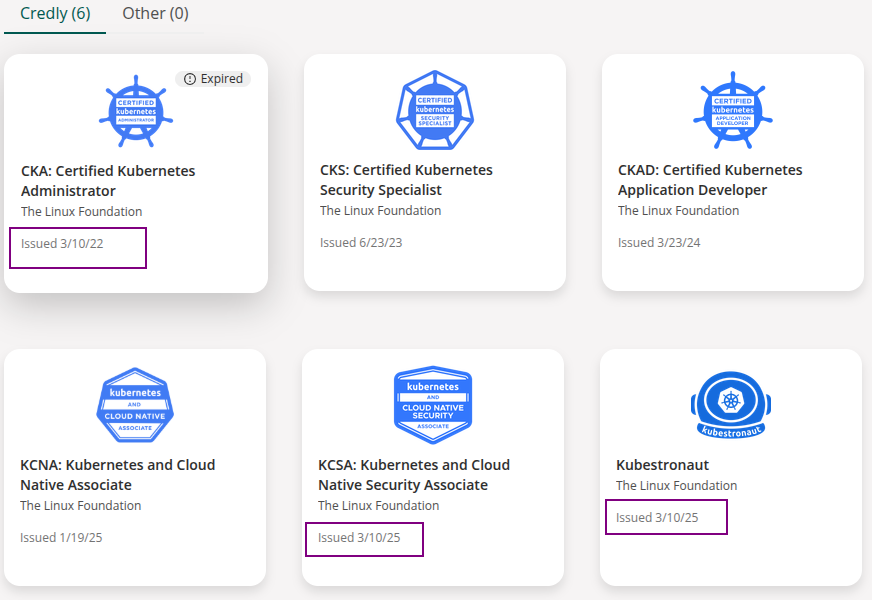

# 前言

3年内成功通过CNCF旗下云原生相关的5个证书，并顺利获得kubestronaut 的领航员的一个称谓，其实我对于证书不是很感冒，证书也证明不了能力，最多只能证明你曾经学习过。

大概在3年以前，公司针对认证证书有一定优惠补助，另外加之当时逢黑色星期五优惠力度很大，所有购买了CKA认证考试，没有怎么学一周就通过了，因为个人对于kubernetes是有一定的运维和管理基础的，2022年3月10日完成了第一个证书。那个时候的证书有效期还是3年的，截止2025年的3.10日，我完成了最后一个KCSA考试，并获得了kubestronaut ，当时收到邮件获得该证书我很是意外和惊喜。

这个时间非常极限，我一度以为CNCF官方不会承认我的这个5个证书是在同一个有效期内，无法得到kubestronaut。

# 为何要做这件事？

起因是由于公司鼓励大家学习提升自身并能够用于工作中，提升整理的技术水平，这是我做这件事情最开始的一个动机。

后来促使我继续参加如下4门考试主要因为我个人对于技术的渴望和追求吧，不然我也想不到有什么更合适的理由了。因为人家造个车都借车（我说的是雷总）几百台，就为了体验不同的产品背后的逻辑，还考了赛车照，肯定不是为了证明自己多牛逼。这里不敢大言不惭和雷布斯比较，我只是觉得如果你认真的对待任何一项技术，相信你的时间也不会白浪费吧。这里不是希望大家在考证书这件事情上浪费时间，但我相信坚持，相信3w小时定律。

# 后面有什么规划？

后面其实规划很简单，就是继续在云原生的道路上继续前行，学习AI相关的技术，探索新的机遇。另外个人还是希望自己继续不忘初心，继续扎实做事，低调做人，行稳才能致远。
